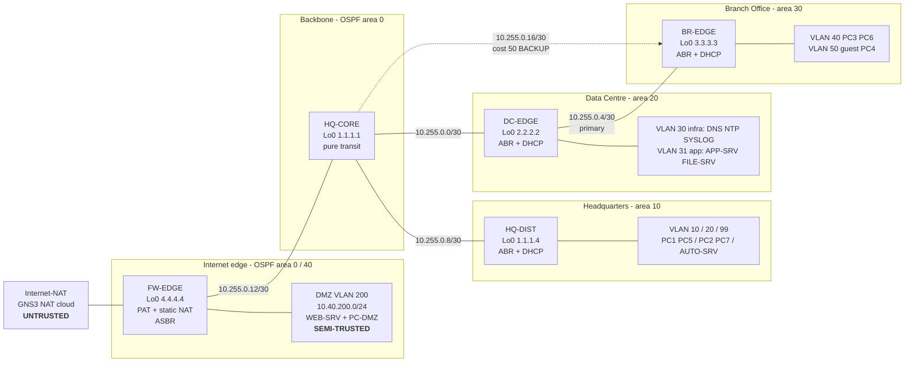
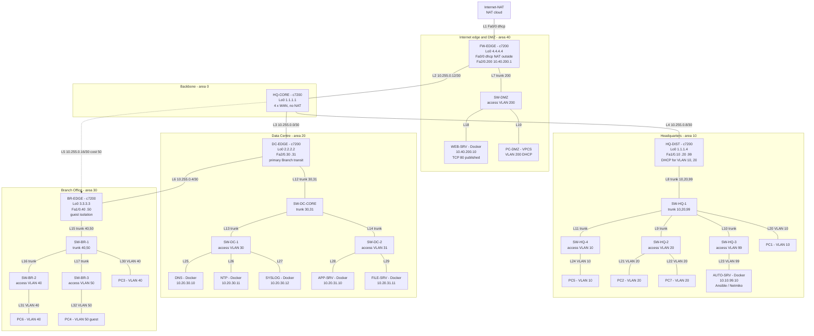
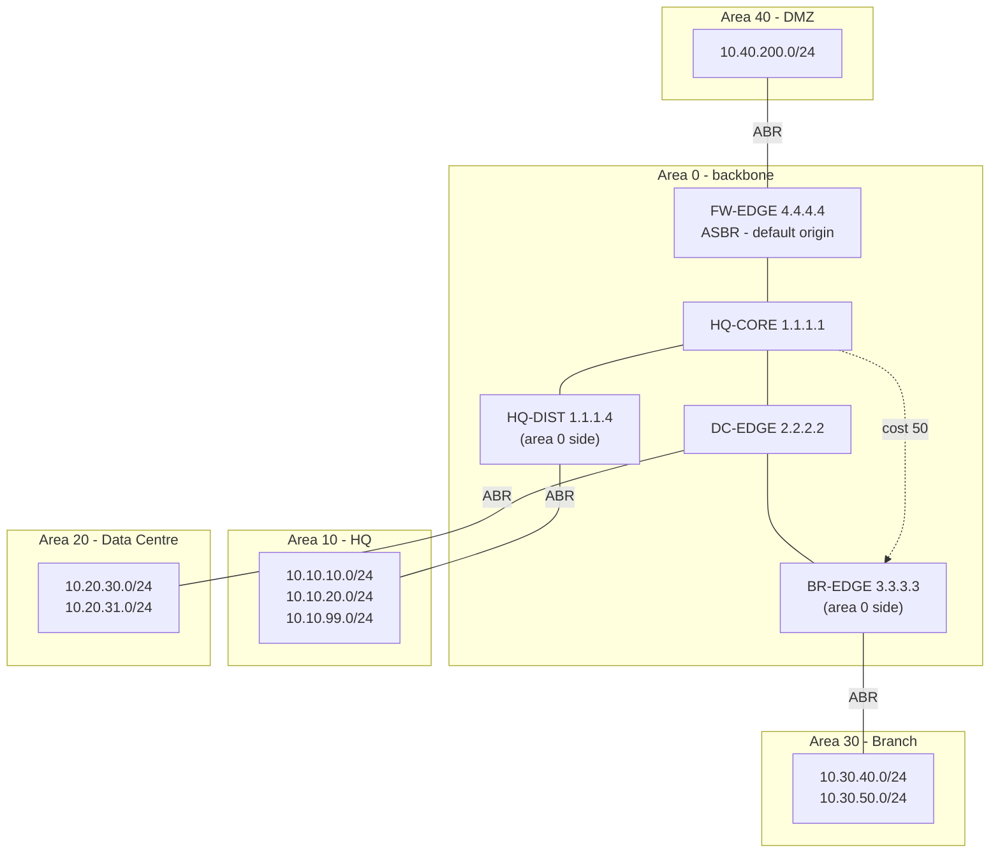

# MN521 Part A — Physical & Logical Topology

Four-zone enterprise built in GNS3: an **Internet edge / DMZ**, **Headquarters (HQ)**, a **Data Centre (DC)**
and a **Branch Office (BR)**, joined by a routed OSPF backbone with a redundant Branch uplink.

Addressing is defined in [IP_ADDRESSING.md](IP_ADDRESSING.md) and is authoritative. This document defines the
node inventory, cabling, switch port roles and traffic paths that implement it. Further additive expansion —
proposed but not part of the assessed baseline — is in
[TOPOLOGY_APPENDIX_COMPLEXITY.md](TOPOLOGY_APPENDIX_COMPLEXITY.md).

**Scale: 32 nodes, 32 links, 8 VLANs, 5 OSPF areas, 5 WAN /30s.**

---

## 1. Node inventory

### 1.1 Routers — Cisco c7200, Dynamips (5)

| # | Node | Role | `Loopback0` | OSPF | Interfaces used |
|---|------|------|-------------|------|-----------------|
| 1 | `FW-EDGE` | Internet edge, PAT, static DMZ translation, edge filtering, default-route origination | `4.4.4.4/32` | ASBR, area 0 + area 40 | `Fa0/0`, `Fa1/0`, `Fa2/0.200` |
| 2 | `HQ-CORE` | Area 0 backbone core — no NAT, no host VLANs | `1.1.1.1/32` | internal, area 0 | `Fa0/0`, `Fa1/0`, `Fa2/0`, `Fa3/0` |
| 3 | `HQ-DIST` | HQ distribution: 802.1Q inter-VLAN routing, DHCP | `1.1.1.4/32` | ABR area 0 ↔ 10 | `Fa0/0`, `Fa1/0.10/.20/.99` |
| 4 | `DC-EDGE` | Data Centre gateway, primary Branch WAN transit, DHCP | `2.2.2.2/32` | ABR area 0 ↔ 20 | `Fa0/0`, `Fa1/0`, `Fa2/0.30/.31` |
| 5 | `BR-EDGE` | Branch gateway, DHCP, guest isolation, backup WAN | `3.3.3.3/32` | ABR area 0 ↔ 30 | `Fa0/0`, `Fa1/0.40/.50`, `Fa2/0` |

### 1.2 Switches — GNS3 built-in Ethernet switch (11)

| # | Node | Layer role | VLANs carried | Uplink to |
|---|------|-----------|---------------|-----------|
| 6 | `SW-DMZ` | DMZ access | 200 | `FW-EDGE Fa2/0` |
| 7 | `SW-HQ-1` | HQ distribution / aggregation | 10, 20, 99 | `HQ-DIST Fa1/0` |
| 8 | `SW-HQ-2` | HQ corporate access | 20 | `SW-HQ-1` |
| 9 | `SW-HQ-3` | HQ management access | 99 | `SW-HQ-1` |
| 10 | `SW-HQ-4` | HQ user access (second floor) | 10 | `SW-HQ-1` |
| 11 | `SW-DC-CORE` | Data Centre core / aggregation | 30, 31 | `DC-EDGE Fa2/0` |
| 12 | `SW-DC-1` | Data Centre infrastructure access | 30 | `SW-DC-CORE` |
| 13 | `SW-DC-2` | Data Centre application access | 31 | `SW-DC-CORE` |
| 14 | `SW-BR-1` | Branch distribution | 40, 50 | `BR-EDGE Fa1/0` |
| 15 | `SW-BR-2` | Branch user access | 40 | `SW-BR-1` |
| 16 | `SW-BR-3` | Branch guest access | 50 | `SW-BR-1` |

### 1.3 Servers — Docker `ubuntu:22.04` (7)

| # | Node | Address | VLAN | Service | Setup script |
|---|------|---------|------|---------|--------------|
| 17 | `AUTO-SRV` | `10.10.99.10/24` | 99 | Ansible / Netmiko control node (Part B) | `configs/linux/auto-srv-setup.sh` |
| 18 | `DNS` | `10.20.30.10/24` | 30 | `dnsmasq`, authoritative for `corp.local` | `configs/linux/dns-setup.sh` |
| 19 | `NTP` | `10.20.30.11/24` | 30 | `chrony`, `local stratum 10` | `configs/linux/ntp-setup.sh` |
| 20 | `SYSLOG` | `10.20.30.12/24` | 30 | `rsyslog`, UDP/TCP 514, per-device files | `configs/linux/syslog-setup.sh` |
| 21 | `APP-SRV` | `10.20.31.10/24` | 31 | Application tier, TCP 8080 | `configs/linux/app-srv-setup.sh` |
| 22 | `FILE-SRV` | `10.20.31.11/24` | 31 | File service, TCP 445 / HTTP index | `configs/linux/file-srv-setup.sh` |
| 23 | `WEB-SRV` | `10.40.200.10/24` | 200 | Public web service, TCP 80 | `configs/linux/web-srv-setup.sh` |

### 1.4 Endpoints — VPCS (8)

| # | Node | VLAN | Expected lease | Represents |
|---|------|------|----------------|------------|
| 24 | `PC1` | 10 | `10.10.10.21` | HQ user, first floor |
| 25 | `PC2` | 20 | `10.10.20.21` | HQ corporate user |
| 26 | `PC3` | 40 | `10.30.40.21` | Branch staff |
| 27 | `PC4` | 50 | `10.30.50.21` | Branch **guest** — isolated |
| 28 | `PC5` | 10 | `10.10.10.22` | HQ user, second floor |
| 29 | `PC6` | 40 | `10.30.40.22` | Branch staff, second switch |
| 30 | `PC7` | 20 | `10.10.20.22` | HQ corporate user |
| 31 | `PC-DMZ` | 200 | `10.40.200.21` | DMZ maintenance / test host |

### 1.5 Cloud (1)

| # | Node | Template | Role |
|---|------|----------|------|
| 32 | `Internet-NAT` | GNS3 NAT cloud | Simulated Internet and upstream DHCP server for `FW-EDGE Fa0/0` |

**Totals: 5 routers, 11 switches, 7 Docker servers, 8 VPCS endpoints, 1 NAT cloud = 32 nodes.**

Resource footprint on a 4 GB GNS3 VM: 5 × Dynamips at 256 MB emulated RAM (~150 MB real each with a
calibrated `idlepc`), 7 containers at tens of megabytes, and 11 switches plus 8 VPCS processes at effectively
zero. The five routers are the entire cost, which is why the expansion in the appendix is built from
switches, containers and clouds rather than from more routers.

---

## 2. Diagrams

### 2.1 Zone and trust overview



### 2.2 Full physical topology



### 2.3 Logical OSPF view



Every non-backbone area attaches to area 0 through exactly one ABR, so no virtual link is required.

---

## 3. Full link table

Router slot layout: **slot 0 = `C7200-IO-FE`** (`Fa0/0`); **slots 1, 2, 3 = `PA-FE-TX`**
(`Fa1/0`, `Fa2/0`, `Fa3/0`). `HQ-CORE` uses all four; `FW-EDGE` and `BR-EDGE` populate slot 3 as well so the
reserved uplinks exist in hardware.

### 3.1 Routed links — Layer 3 (6)

| # | A end | A interface | A address | B end | B interface | B address | Subnet | Area | Cost |
|---|-------|-------------|-----------|-------|-------------|-----------|--------|------|------|
| L1 | `Internet-NAT` | `nat0` (port 0) | GNS3 pool | `FW-EDGE` | `Fa0/0` | DHCP | GNS3 default `192.168.122.0/24` | — | — |
| L2 | `FW-EDGE` | `Fa1/0` | `10.255.0.13/30` | `HQ-CORE` | `Fa0/0` | `10.255.0.14/30` | `10.255.0.12/30` | 0 | 1 |
| L3 | `HQ-CORE` | `Fa1/0` | `10.255.0.1/30` | `DC-EDGE` | `Fa0/0` | `10.255.0.2/30` | `10.255.0.0/30` | 0 | 1 |
| L4 | `HQ-CORE` | `Fa2/0` | `10.255.0.9/30` | `HQ-DIST` | `Fa0/0` | `10.255.0.10/30` | `10.255.0.8/30` | 0 | 1 |
| L5 | `HQ-CORE` | `Fa3/0` | `10.255.0.17/30` | `BR-EDGE` | `Fa2/0` | `10.255.0.18/30` | `10.255.0.16/30` | 0 | **50** |
| L6 | `DC-EDGE` | `Fa1/0` | `10.255.0.5/30` | `BR-EDGE` | `Fa0/0` | `10.255.0.6/30` | `10.255.0.4/30` | 0 | 1 |

L5 is the redundant Branch uplink. Its cost is deliberately raised so that L6 remains the primary Branch
path; see [REVIEW_FINDINGS.md](REVIEW_FINDINGS.md) R-03.

### 3.2 Trunk links — 802.1Q (11)

| # | A end | A interface / port | B end | B port | Allowed VLANs | Native | Router subinterfaces |
|---|-------|--------------------|-------|--------|---------------|--------|----------------------|
| L7 | `FW-EDGE` | `Fa2/0` | `SW-DMZ` | 0 (`dot1q`) | 200 | 1 (unused) | `Fa2/0.200` |
| L8 | `HQ-DIST` | `Fa1/0` | `SW-HQ-1` | 0 (`dot1q`) | 10, 20, 99 | 1 (unused) | `Fa1/0.10/.20/.99` |
| L9 | `SW-HQ-1` | 2 (`dot1q`) | `SW-HQ-2` | 0 (`dot1q`) | 10, 20, 99 | 1 (unused) | — |
| L10 | `SW-HQ-1` | 3 (`dot1q`) | `SW-HQ-3` | 0 (`dot1q`) | 10, 20, 99 | 1 (unused) | — |
| L11 | `SW-HQ-1` | 4 (`dot1q`) | `SW-HQ-4` | 0 (`dot1q`) | 10, 20, 99 | 1 (unused) | — |
| L12 | `DC-EDGE` | `Fa2/0` | `SW-DC-CORE` | 0 (`dot1q`) | 30, 31 | 1 (unused) | `Fa2/0.30/.31` |
| L13 | `SW-DC-CORE` | 1 (`dot1q`) | `SW-DC-1` | 0 (`dot1q`) | 30, 31 | 1 (unused) | — |
| L14 | `SW-DC-CORE` | 2 (`dot1q`) | `SW-DC-2` | 0 (`dot1q`) | 30, 31 | 1 (unused) | — |
| L15 | `BR-EDGE` | `Fa1/0` | `SW-BR-1` | 0 (`dot1q`) | 40, 50 | 1 (unused) | `Fa1/0.40/.50` |
| L16 | `SW-BR-1` | 2 (`dot1q`) | `SW-BR-2` | 0 (`dot1q`) | 40, 50 | 1 (unused) | — |
| L17 | `SW-BR-1` | 3 (`dot1q`) | `SW-BR-3` | 0 (`dot1q`) | 40, 50 | 1 (unused) | — |

Every data VLAN is carried **tagged** and VLAN 1 is left empty. The GNS3 built-in switch has no
`switchport trunk allowed vlan` equivalent, so a `dot1q` port carries every VLAN present on the switch; the
"Allowed VLANs" column therefore records design intent and the actual pruning is achieved by which VLANs
exist on which switch.

### 3.3 Access links — Layer 2 edge (15)

| # | Switch | Port | Mode | VLAN | End device | Device port | Address |
|---|--------|------|------|------|------------|-------------|---------|
| L18 | `SW-DMZ` | 1 | access | 200 | `WEB-SRV` | `eth0` | `10.40.200.10/24` static |
| L19 | `SW-DMZ` | 2 | access | 200 | `PC-DMZ` | `e0` | DHCP → `10.40.200.21` |
| L20 | `SW-HQ-1` | 1 | access | 10 | `PC1` | `e0` | DHCP → `10.10.10.21` |
| L21 | `SW-HQ-2` | 1 | access | 20 | `PC2` | `e0` | DHCP → `10.10.20.21` |
| L22 | `SW-HQ-2` | 2 | access | 20 | `PC7` | `e0` | DHCP → `10.10.20.22` |
| L23 | `SW-HQ-3` | 1 | access | 99 | `AUTO-SRV` | `eth0` | `10.10.99.10/24` static |
| L24 | `SW-HQ-4` | 1 | access | 10 | `PC5` | `e0` | DHCP → `10.10.10.22` |
| L25 | `SW-DC-1` | 1 | access | 30 | `DNS` | `eth0` | `10.20.30.10/24` static |
| L26 | `SW-DC-1` | 2 | access | 30 | `NTP` | `eth0` | `10.20.30.11/24` static |
| L27 | `SW-DC-1` | 3 | access | 30 | `SYSLOG` | `eth0` | `10.20.30.12/24` static |
| L28 | `SW-DC-2` | 1 | access | 31 | `APP-SRV` | `eth0` | `10.20.31.10/24` static |
| L29 | `SW-DC-2` | 2 | access | 31 | `FILE-SRV` | `eth0` | `10.20.31.11/24` static |
| L30 | `SW-BR-1` | 1 | access | 40 | `PC3` | `e0` | DHCP → `10.30.40.21` |
| L31 | `SW-BR-2` | 1 | access | 40 | `PC6` | `e0` | DHCP → `10.30.40.22` |
| L32 | `SW-BR-3` | 1 | access | 50 | `PC4` | `e0` | DHCP → `10.30.50.21` |

### 3.4 Reserved and deliberately unused interfaces

| Device | Interface | State | Reason |
|--------|-----------|-------|--------|
| `FW-EDGE` | `Fa3/0` | `shutdown`, no address | Reserved for the second ISP uplink in `TOPOLOGY_APPENDIX_COMPLEXITY.md` §3.1 |
| `HQ-DIST` | `Fa2/0` | `shutdown`, no address | Reserved growth trunk for a further HQ access block |
| all routers | `line aux 0` | `no exec`, `transport input none` | Unused management line closed |
| all switches | unused ports | left at default | The built-in switch has no port-security equivalent; unused ports carry no cable |

Reserved interfaces are held administratively down rather than left up-with-no-address so they cannot become
an unauthenticated entry point, and so `show ip interface brief` distinguishes "reserved" from "broken".

---

## 4. GNS3 switch port matrix

Apply in each switch's **Configure → Ports** tab as `VLAN` / `Type`. Trunk ports are `dot1q` with VLAN 1 as
the (unused) native VLAN; host ports are `access` on their data VLAN.

| Switch | port 0 | port 1 | port 2 | port 3 | port 4 |
|--------|--------|--------|--------|--------|--------|
| `SW-DMZ` | 1 / dot1q → `FW-EDGE Fa2/0` | 200 / access → `WEB-SRV` | 200 / access → `PC-DMZ` | — | — |
| `SW-HQ-1` | 1 / dot1q → `HQ-DIST Fa1/0` | 10 / access → `PC1` | 1 / dot1q → `SW-HQ-2` | 1 / dot1q → `SW-HQ-3` | 1 / dot1q → `SW-HQ-4` |
| `SW-HQ-2` | 1 / dot1q → `SW-HQ-1` | 20 / access → `PC2` | 20 / access → `PC7` | — | — |
| `SW-HQ-3` | 1 / dot1q → `SW-HQ-1` | 99 / access → `AUTO-SRV` | — | — | — |
| `SW-HQ-4` | 1 / dot1q → `SW-HQ-1` | 10 / access → `PC5` | — | — | — |
| `SW-DC-CORE` | 1 / dot1q → `DC-EDGE Fa2/0` | 1 / dot1q → `SW-DC-1` | 1 / dot1q → `SW-DC-2` | — | — |
| `SW-DC-1` | 1 / dot1q → `SW-DC-CORE` | 30 / access → `DNS` | 30 / access → `NTP` | 30 / access → `SYSLOG` | — |
| `SW-DC-2` | 1 / dot1q → `SW-DC-CORE` | 31 / access → `APP-SRV` | 31 / access → `FILE-SRV` | — | — |
| `SW-BR-1` | 1 / dot1q → `BR-EDGE Fa1/0` | 40 / access → `PC3` | 1 / dot1q → `SW-BR-2` | 1 / dot1q → `SW-BR-3` | — |
| `SW-BR-2` | 1 / dot1q → `SW-BR-1` | 40 / access → `PC6` | — | — | — |
| `SW-BR-3` | 1 / dot1q → `SW-BR-1` | 50 / access → `PC4` | — | — | — |

A port left at the GNS3 default of `1 / access` is the single most common cause of a host failing to get a
DHCP lease in this topology, because VLAN 1 is not routed anywhere.

---

## 5. Layer 2 loop-freedom

The GNS3 built-in Ethernet switch implements no spanning tree, so the Layer 2 topology must be a tree by
construction. It is:

```
FW-EDGE  ── SW-DMZ
HQ-DIST  ── SW-HQ-1 ── SW-HQ-2
                    ├─ SW-HQ-3
                    └─ SW-HQ-4
DC-EDGE  ── SW-DC-CORE ── SW-DC-1
                        └─ SW-DC-2
BR-EDGE  ── SW-BR-1 ── SW-BR-2
                    └─ SW-BR-3
```

Each switch has exactly one path toward its router. **Do not add a second switch-to-switch link anywhere.**
There is nothing to block a loop, so a redundant Layer 2 path produces a broadcast storm that saturates the
GNS3 VM. Redundancy in this design is provided at Layer 3 by OSPF (link L5), which is where it belongs
architecturally in any case.

---

## 6. Traffic flows and enforcement

| # | Flow | Path | Policy applied |
|---|------|------|----------------|
| 1 | HQ user → Internet | `PC1` → `HQ-DIST` → `HQ-CORE` → `FW-EDGE` → `Internet-NAT` | PAT on `FW-EDGE Fa0/0` |
| 2 | HQ user → DC services | `PC1` → `HQ-DIST` → `HQ-CORE` → `DC-EDGE` → server | permitted (area 10 → 0 → 20) |
| 3 | HQ user → HQ management VLAN | blocked at `HQ-DIST Fa1/0.10` in | `ACL_HQ_USERS_IN` |
| 4 | Branch staff → DC services | `PC3` → `BR-EDGE` → `DC-EDGE` → server | permitted; `ACL_WAN_BR_IN` inspected on `DC-EDGE Fa1/0` |
| 5 | Branch guest → Internet | `PC4` → `BR-EDGE` → `DC-EDGE` → `HQ-CORE` → `FW-EDGE` | permitted by the final `permit` in `ACL_GUEST_IN`, then PAT |
| 6 | Branch guest → DNS name resolution | `PC4` → `BR-EDGE` → `DC-EDGE` → `DNS:53` | explicit `permit udp/tcp … eq 53` above the denies |
| 7 | Branch guest → any corporate subnet, DMZ or WAN address | blocked at `BR-EDGE Fa1/0.50` in, and again on `DC-EDGE Fa1/0` / `HQ-CORE Fa3/0` | `ACL_GUEST_IN` + `ACL_WAN_BR_IN` at both WAN egress points |
| 8 | Internet → DMZ web service | `Internet-NAT` → `FW-EDGE Fa0/0` → static NAT → `WEB-SRV:80` | `ACL_INTERNET_IN` permits TCP 80 only; ACL is evaluated **before** the destination is translated |
| 9 | DMZ host → internal subnets | blocked at `FW-EDGE Fa2/0.200` in | `ACL_DMZ_IN` — a compromised DMZ host cannot pivot inward |
| 10 | DMZ host → DNS / NTP / syslog | `FW-EDGE` → `HQ-CORE` → `DC-EDGE` → VLAN 30 | explicit per-service permits above the denies in `ACL_DMZ_IN` |
| 11 | Automation SSH | `AUTO-SRV 10.10.99.10` → any router `Loopback0` | `ACL_VTY` permits that host and the DC infrastructure VLAN only |
| 12 | Router → DNS / NTP / syslog | any router `Loopback0` → `10.20.30.10/.11/.12` | sourced from `Loopback0` for stable device identity |
| 13 | Branch → HQ during a DC failure | `PC3` → `BR-EDGE Fa2/0` → `HQ-CORE` → `HQ-DIST` | OSPF reconverges onto L5; `ACL_WAN_BR_IN` on `HQ-CORE Fa3/0` keeps guest policy intact |

Flow 13 is the reason the redundant link exists and the reason its ACL exists. Flow 8 is the only
inbound-initiated flow in the design, and it terminates in the DMZ — never in a trusted zone.

---

## 7. Mapping to the live GNS3 project

The student's GNS3 project uses role-descriptive labels for some switches. The mapping is one-to-one:

| This document | Equivalent live label(s) | Role |
|---------------|--------------------------|------|
| `SW-HQ-1` | HQ-DIST switch / HQ aggregation | HQ 802.1Q aggregation |
| `SW-HQ-2`, `SW-HQ-3`, `SW-HQ-4` | HQ access switches | HQ access layer |
| `SW-DC-CORE` | DC-CORE | Data Centre aggregation |
| `SW-DC-1`, `SW-DC-2` | DC access switches | Data Centre access layer |
| `SW-BR-1` | BR-DIST | Branch distribution |
| `SW-BR-2`, `SW-BR-3` | Branch access switches | Branch access layer |
| `SW-DMZ` | DMZ switch | DMZ access |
| `Internet-NAT` | Internet-NAT | NAT cloud |

Rename the GNS3 nodes to the names in §1 before capturing screenshots. Every configuration file, ACL
`remark`, interface `description`, verification step and report table references these names, so a rename is
the cheapest way to make the evidence self-consistent.
