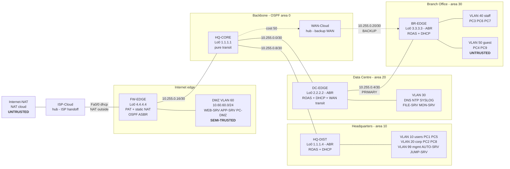
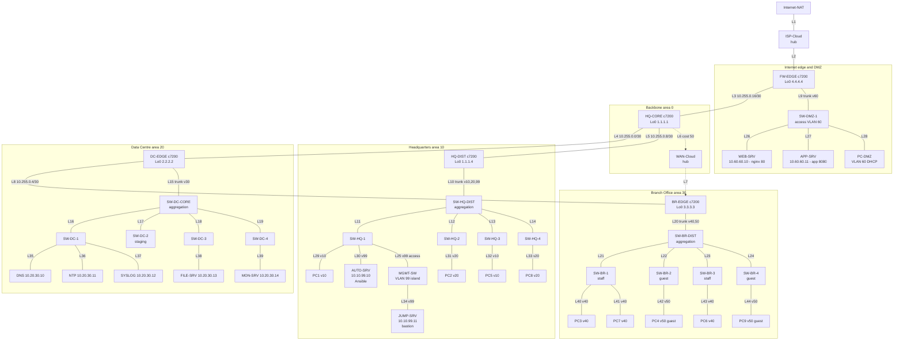
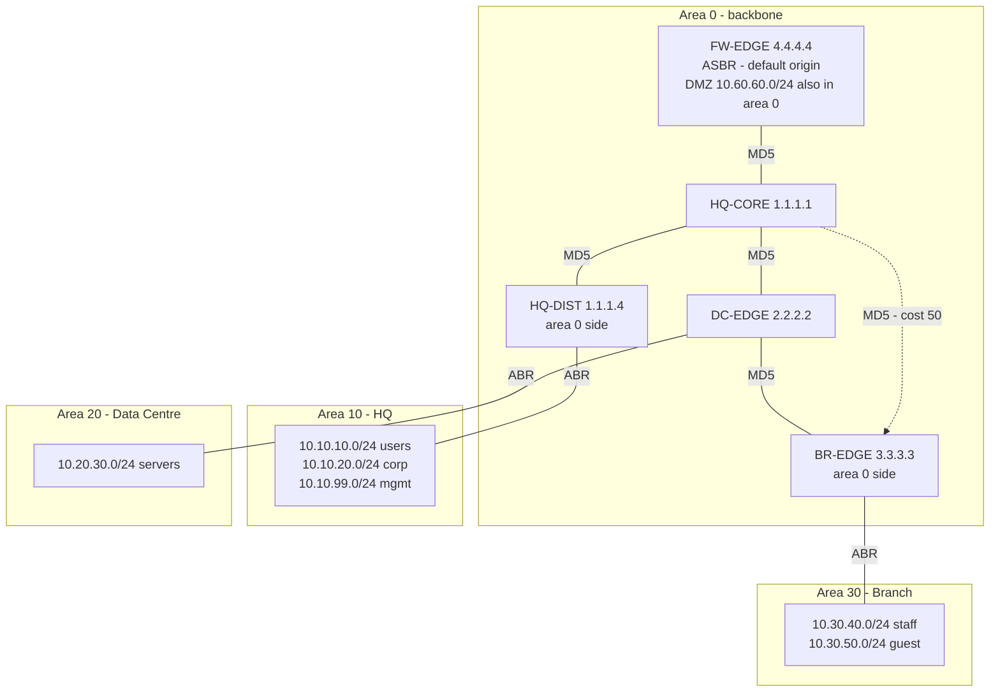

# MN521 Part A — Topology

Four-zone enterprise built in GNS3: an **Internet edge with a DMZ**, **Headquarters**,
a **Data Centre** and a **Branch Office**, joined by an OSPF backbone with a
cost-engineered redundant WAN.

**44 nodes / 50 links.** Of the 50 links, 44 forward traffic, 3 are cabled standby
ports held administratively down, and 3 must be deleted because they close Layer 2
loops (§5).

Addressing is authoritative in [`IP_ADDRESSING.md`](IP_ADDRESSING.md). Per-node
purpose and configuration is in [`NODE_INVENTORY.md`](NODE_INVENTORY.md). The raw
live export is [`LINK_MAP.md`](LINK_MAP.md).

---

## 1. Zones and trust model

| Zone | Trust | Contents | Gateway | OSPF area |
|------|-------|----------|---------|-----------|
| Internet | **Untrusted** | `Internet-NAT`, `ISP-Cloud` | — | — |
| DMZ | **Semi-trusted** — reachable from outside, may not initiate inward | `SW-DMZ-1`, `WEB-SRV`, `APP-SRV`, `PC-DMZ` | `FW-EDGE Fa2/0.60` | 0 |
| WAN backbone | Trusted, no end hosts | 5 routers, `WAN-Cloud` | — | 0 |
| Headquarters | Trusted | `HQ-CORE`, `HQ-DIST`, 6 switches, `AUTO-SRV`, `JUMP-SRV`, `PC1`/`PC2`/`PC5`/`PC8` | `HQ-DIST Fa2/0.10/.20/.99` | 10 |
| Data Centre | Trusted | `DC-EDGE`, 5 switches, `DNS`, `NTP`, `SYSLOG`, `FILE-SRV`, `MON-SRV` | `DC-EDGE Fa3/0.30` | 20 |
| Branch — staff | Trusted | `BR-EDGE`, `SW-BR-1/3`, `PC3`/`PC6`/`PC7` | `BR-EDGE Fa3/0.40` | 30 |
| Branch — guest | **Untrusted** | `SW-BR-2/4`, `PC4`/`PC9` | `BR-EDGE Fa3/0.50` | 30 |

The Branch contains both the most and least trusted internal segments, one hop
apart. That is deliberate: it is the hardest containment problem in the design and
the one the ACL evidence targets.

---

## 2. Diagrams

### 2.1 Figure 1 — Zone overview



### 2.2 Figure 2 — Physical topology, all 44 nodes



### 2.3 Figure 3 — Logical OSPF view



Every non-backbone area attaches to area 0 through exactly one ABR, so no virtual
link is needed. **Five** adjacencies exist in total — one per area 0 link — all
MD5-authenticated. Per-router neighbour counts: `HQ-CORE` 4, `DC-EDGE` 2,
`BR-EDGE` 2, `FW-EDGE` 1, `HQ-DIST` 1, which sums to 10 endpoints for 5 adjacencies.

---

## 3. Link table

### 3.1 Path segments and routed links (L1–L8)

| # | A end | A interface | A address | B end | B interface | B address | Subnet | Area | Cost |
|---|-------|-------------|-----------|-------|-------------|-----------|--------|------|------|
| L1 | `Internet-NAT` | `nat0` | GNS3 pool | `ISP-Cloud` | hub port | — | GNS3 default `192.168.122.0/24` | — | — |
| L2 | `ISP-Cloud` | hub port | — | `FW-EDGE` | `Fa0/0` | DHCP | same segment as L1 | — | — |
| L3 | `FW-EDGE` | `Fa1/0` | `10.255.0.17` | `HQ-CORE` | `Fa0/0` | `10.255.0.18` | `10.255.0.16/30` | 0 | 1 |
| L4 | `HQ-CORE` | `Fa1/0` | `10.255.0.1` | `DC-EDGE` | `Fa0/0` | `10.255.0.2` | `10.255.0.0/30` | 0 | 1 |
| L5 | `HQ-CORE` | `Fa2/0` | `10.255.0.9` | `HQ-DIST` | `Fa0/0` | `10.255.0.10` | `10.255.0.8/30` | 0 | 1 |
| L6 | `HQ-CORE` | `Fa3/0` | `10.255.0.21` | `WAN-Cloud` | hub port | — | `10.255.0.20/30` | 0 | **50** |
| L7 | `WAN-Cloud` | hub port | — | `BR-EDGE` | `Fa2/0` | `10.255.0.22` | same segment as L6 | 0 | **50** |
| L8 | `DC-EDGE` | `Fa1/0` | `10.255.0.5` | `BR-EDGE` | `Fa0/0` | `10.255.0.6` | `10.255.0.4/30` | 0 | 1 |

L1+L2 are one IP segment; so are L6+L7. The hub in the middle is transparent, so
the `/30` spans it and OSPF forms a single adjacency across it.

### 3.2 Trunk links, 802.1Q (L9–L24)

All are `dot1q` with native VLAN 1, which is unused — every data VLAN is tagged.

| # | A end | A port | B end | B port | VLANs carried |
|---|-------|--------|-------|--------|---------------|
| L9 | `FW-EDGE` | `Fa2/0` | `SW-DMZ-1` | `Eth0` | 60 |
| L10 | `HQ-DIST` | `Fa2/0` | `SW-HQ-DIST` | `Eth0` | 10, 20, 99 |
| L11 | `SW-HQ-DIST` | `Eth1` | `SW-HQ-1` | `Eth4` | 10, 20, 99 |
| L12 | `SW-HQ-DIST` | `Eth2` | `SW-HQ-2` | `Eth2` | 10, 20, 99 |
| L13 | `SW-HQ-DIST` | `Eth3` | `SW-HQ-3` | `Eth0` | 10, 20, 99 |
| L14 | `SW-HQ-DIST` | `Eth5` | `SW-HQ-4` | `Eth0` | 10, 20, 99 |
| L15 | `DC-EDGE` | `Fa3/0` | `SW-DC-CORE` | `Eth0` | 30 |
| L16 | `SW-DC-CORE` | `Eth1` | `SW-DC-1` | `Eth6` | 30 |
| L17 | `SW-DC-CORE` | `Eth2` | `SW-DC-2` | `Eth6` | 30 |
| L18 | `SW-DC-CORE` | `Eth3` | `SW-DC-3` | `Eth0` | 30 |
| L19 | `SW-DC-CORE` | `Eth5` | `SW-DC-4` | `Eth0` | 30 |
| L20 | `BR-EDGE` | `Fa3/0` | `SW-BR-DIST` | `Eth0` | 40, 50 |
| L21 | `SW-BR-DIST` | `Eth1` | `SW-BR-1` | `Eth6` | 40, 50 |
| L22 | `SW-BR-DIST` | `Eth2` | `SW-BR-2` | `Eth6` | 40, 50 |
| L23 | `SW-BR-DIST` | `Eth3` | `SW-BR-3` | `Eth0` | 40, 50 |
| L24 | `SW-BR-DIST` | `Eth5` | `SW-BR-4` | `Eth0` | 40, 50 |

The GNS3 built-in switch has no `switchport trunk allowed vlan` equivalent, so a
`dot1q` port carries every VLAN defined on that switch. The "VLANs carried" column
is therefore design intent; actual pruning comes from which VLANs exist on which
switch.

### 3.3 Untagged management link (L25)

| # | A end | A port | B end | B port | Mode | VLAN |
|---|-------|--------|-------|--------|------|------|
| L25 | `SW-HQ-1` | `Eth5` | `MGMT-SW` | `Eth0` | access ↔ access | 99 |

The only switch-to-switch link that is not a trunk. `MGMT-SW` carries one VLAN, so
the segment is physically incapable of carrying another — a mis-set trunk cannot
leak a user VLAN onto the management island.

### 3.4 Access links to end devices (L26–L44)

| # | Switch | Port | VLAN | Device | Addressing |
|---|--------|------|-----:|--------|------------|
| L26 | `SW-DMZ-1` | `Eth1` | 60 | `WEB-SRV` | `10.60.60.10/24` static |
| L27 | `SW-DMZ-1` | `Eth2` | 60 | `APP-SRV` | `10.60.60.11/24` static |
| L28 | `SW-DMZ-1` | `Eth3` | 60 | `PC-DMZ` | DHCP from `FW-EDGE` |
| L29 | `SW-HQ-1` | `Eth1` | 10 | `PC1` | DHCP from `HQ-DIST` |
| L30 | `SW-HQ-1` | `Eth2` | 99 | `AUTO-SRV` | `10.10.99.10/24` static |
| L31 | `SW-HQ-2` | `Eth1` | 20 | `PC2` | DHCP from `HQ-DIST` |
| L32 | `SW-HQ-3` | `Eth1` | 10 | `PC5` | DHCP from `HQ-DIST` |
| L33 | `SW-HQ-4` | `Eth1` | 20 | `PC8` | DHCP from `HQ-DIST` |
| L34 | `MGMT-SW` | `Eth1` | 99 | `JUMP-SRV` | `10.10.99.11/24` static |
| L35 | `SW-DC-1` | `Eth1` | 30 | `DNS` | `10.20.30.10/24` static |
| L36 | `SW-DC-1` | `Eth2` | 30 | `NTP` | `10.20.30.11/24` static |
| L37 | `SW-DC-1` | `Eth3` | 30 | `SYSLOG` | `10.20.30.12/24` static |
| L38 | `SW-DC-3` | `Eth1` | 30 | `FILE-SRV` | `10.20.30.13/24` static |
| L39 | `SW-DC-4` | `Eth1` | 30 | `MON-SRV` | `10.20.30.14/24` static |
| L40 | `SW-BR-1` | `Eth1` | 40 | `PC3` | DHCP from `BR-EDGE` |
| L41 | `SW-BR-1` | `Eth3` | 40 | `PC7` | DHCP from `BR-EDGE` |
| L42 | `SW-BR-2` | `Eth1` | 50 | `PC4` | DHCP from `BR-EDGE` (guest scope) |
| L43 | `SW-BR-3` | `Eth1` | 40 | `PC6` | DHCP from `BR-EDGE` |
| L44 | `SW-BR-4` | `Eth1` | 50 | `PC9` | DHCP from `BR-EDGE` (guest scope) |

### 3.5 Cabled standby links, held administratively down (L45–L47)

| # | Router end | Switch end | State | Reason |
|---|-----------|------------|-------|--------|
| L45 | `HQ-DIST Fa1/0` | `SW-HQ-1 Eth0` | `shutdown` | `SW-HQ-1` is also reached via `SW-HQ-DIST`; only one path may be active |
| L46 | `DC-EDGE Fa2/0` | `SW-DC-1 Eth0` | `shutdown` | `SW-DC-1` is also reached via `SW-DC-CORE` |
| L47 | `BR-EDGE Fa1/0` | `SW-BR-1 Eth0` | `shutdown` | `SW-BR-1` is also reached via `SW-BR-DIST` |

These are the expected state, not missed `no shutdown` commands. Each is a
pre-cabled recovery path: if an aggregation switch fails, bringing up the
corresponding router port and moving the VLAN subinterfaces restores that access
switch without recabling.

### 3.6 Links that MUST be deleted — Layer 2 loops (L48–L50)

| # | Link | Loop it closes | Action |
|---|------|----------------|--------|
| L48 | `SW-HQ-1 Eth7` ↔ `SW-HQ-2 Eth0` | `SW-HQ-1` – `SW-HQ-2` – `SW-HQ-DIST` – `SW-HQ-1` | **Delete in GNS3** |
| L49 | `SW-DC-1 Eth7` ↔ `SW-DC-2 Eth0` | `SW-DC-1` – `SW-DC-2` – `SW-DC-CORE` – `SW-DC-1` | **Delete in GNS3** |
| L50 | `SW-BR-1 Eth7` ↔ `SW-BR-2 Eth0` | `SW-BR-1` – `SW-BR-2` – `SW-BR-DIST` – `SW-BR-1` | **Delete in GNS3** |

See §5. Deleting these does not disconnect anything: every affected switch retains
its uplink to its aggregation switch (`SW-HQ-2` via `Eth2`, `SW-DC-2` via `Eth6`,
`SW-BR-2` via `Eth6`).

---

## 4. Traffic flows and where policy is applied

| # | Flow | Path | Enforcement |
|---|------|------|-------------|
| 1 | HQ user → Internet | `PC1` → `HQ-DIST` → `HQ-CORE` → `FW-EDGE` → `ISP-Cloud` → `Internet-NAT` | PAT on `FW-EDGE Fa0/0` |
| 2 | HQ user → DC services | `PC1` → `HQ-DIST` → `HQ-CORE` → `DC-EDGE` → VLAN 30 | permitted, area 10 → 0 → 20 |
| 3 | HQ user → HQ management VLAN | blocked at `HQ-DIST Fa2/0.10` in | `ACL_HQ_USERS_IN` |
| 4 | Branch staff → DC services | `PC3` → `BR-EDGE` → `DC-EDGE` → VLAN 30 | permitted; inspected by `ACL_WAN_BR_IN` |
| 5 | Branch guest → Internet | `PC4` → `BR-EDGE` → `DC-EDGE` → `HQ-CORE` → `FW-EDGE` | final `permit` in `ACL_GUEST_IN`, then PAT |
| 6 | Branch guest → DNS name resolution | `PC4` → … → `DNS:53` | explicit `permit udp/tcp … eq 53` above the denies |
| 7 | Branch guest → any corporate subnet, DMZ, or WAN address | blocked at `BR-EDGE Fa3/0.50`, and again at `DC-EDGE Fa1/0` / `HQ-CORE Fa3/0` | `ACL_GUEST_IN` + `ACL_WAN_BR_IN` on both WAN egress points |
| 8 | Internet → DMZ web service | `Internet-NAT` → `FW-EDGE Fa0/0` → static NAT → `WEB-SRV:80` | `ACL_OUTSIDE_IN` permits TCP 80 only; ACL evaluated **before** the destination is translated |
| 9 | Internet → DMZ app service | as above to `APP-SRV:8080` | `ACL_OUTSIDE_IN` permits TCP 8080 only |
| 10 | DMZ host → any trusted zone | blocked at `FW-EDGE Fa2/0.60` in | `ACL_DMZ_IN` — a compromised DMZ host cannot pivot inward |
| 11 | DMZ host → DNS / NTP / Syslog | `FW-EDGE` → `HQ-CORE` → `DC-EDGE` → VLAN 30 | explicit per-host, per-port permits above the denies |
| 12 | Administrative SSH | `AUTO-SRV` or `JUMP-SRV` → any router `Loopback0` | `ACL_VTY` on both VTY ranges |
| 13 | Router → DNS / NTP / Syslog | any router `Loopback0` → `10.20.30.10/.11/.12` | sourced from `Loopback0` for stable device identity |
| 14 | Branch → HQ during a Data Centre failure | `PC3` → `BR-EDGE Fa2/0` → `WAN-Cloud` → `HQ-CORE` → `HQ-DIST` | OSPF reconverges onto L6/L7; `ACL_WAN_BR_IN` on `HQ-CORE Fa3/0` keeps guest policy intact |

Flows 8 and 9 are the only inbound-initiated flows, and both terminate in the DMZ.
Flow 14 is why the redundant WAN exists and why its ACL exists.

---

## 5. Layer 2 loop-freedom

The GNS3 built-in Ethernet switch implements access ports and 802.1Q tagging and
nothing else — **no spanning tree**. There is no mechanism to block a redundant
path, so the Layer 2 topology must be a tree by construction. A loop here does not
degrade gracefully: broadcast frames circulate indefinitely, and on a 4 GB GNS3 VM
the storm saturates the host.

The live export contains three triangles, which is a genuine defect, not a
theoretical concern. Note that the three shut router ports (§3.5) do **not** fix
them: those address a different loop, between a router's two attachments to the same
access switch.

### Required tree after deleting L48–L50

```
FW-EDGE  Fa2/0 ── SW-DMZ-1 ── WEB-SRV, APP-SRV, PC-DMZ

HQ-DIST  Fa2/0 ── SW-HQ-DIST ─┬─ SW-HQ-1 ─┬─ PC1
                              │           ├─ AUTO-SRV
                              │           └─ MGMT-SW ── JUMP-SRV
                              ├─ SW-HQ-2 ─── PC2
                              ├─ SW-HQ-3 ─── PC5
                              └─ SW-HQ-4 ─── PC8

DC-EDGE  Fa3/0 ── SW-DC-CORE ─┬─ SW-DC-1 ─┬─ DNS
                              │           ├─ NTP
                              │           └─ SYSLOG
                              ├─ SW-DC-2  (staging, VLAN 30 ports ready)
                              ├─ SW-DC-3 ─── FILE-SRV
                              └─ SW-DC-4 ─── MON-SRV

BR-EDGE  Fa3/0 ── SW-BR-DIST ─┬─ SW-BR-1 ─┬─ PC3
                              │           └─ PC7
                              ├─ SW-BR-2 ─── PC4    (guest)
                              ├─ SW-BR-3 ─── PC6
                              └─ SW-BR-4 ─── PC9    (guest)
```

Every switch has exactly one path toward its router. **Do not add any further
switch-to-switch link.**

Layer 2 redundancy is therefore out of scope, and redundancy is provided at Layer 3
by OSPF instead (L6/L7) — which is where this design would put it in production
regardless. See [`REVIEW_FINDINGS.md`](REVIEW_FINDINGS.md) R-02 and R-16.

---

## 6. Link count reconciliation

| Category | Count |
|----------|------:|
| Path segments and routed links (L1–L8) | 8 |
| 802.1Q trunks (L9–L24) | 16 |
| Untagged management link (L25) | 1 |
| Access links to end devices (L26–L44) | 19 |
| **Forwarding links** | **44** |
| Cabled standby, held down (L45–L47) | 3 |
| **Total as currently wired** | **47** |
| Loop links to delete (L48–L50) | 3 |
| **Total in the live export** | **50** |

---

## 7. Platform footprint

| Node class | Count | Cost on a 4 GB GNS3 VM |
|-----------|------:|------------------------|
| Dynamips c7200 | 5 | ~150 MB real RAM each with a calibrated `idlepc` — the entire budget |
| Ethernet switch | 17 | negligible; runs in the GNS3 server process |
| Ethernet hub | 2 | negligible |
| NAT cloud | 1 | negligible |
| Docker Ubuntu | 9 | tens of MB each; shares the VM kernel, no CPU emulation |
| VPCS | 10 | negligible |

This is why the topology grows through switches, containers and hubs rather than
more routers. Router slots are populated as **slot 0 = `C7200-IO-FE`**
(`Fa0/0`) and **slots 1–3 = `PA-FE-TX`** (`Fa1/0`, `Fa2/0`, `Fa3/0`), so all
interfaces are FastEthernet, every link costs a uniform OSPF 1, and the only
non-default cost in the design (50, on the backup WAN) is unambiguous.
