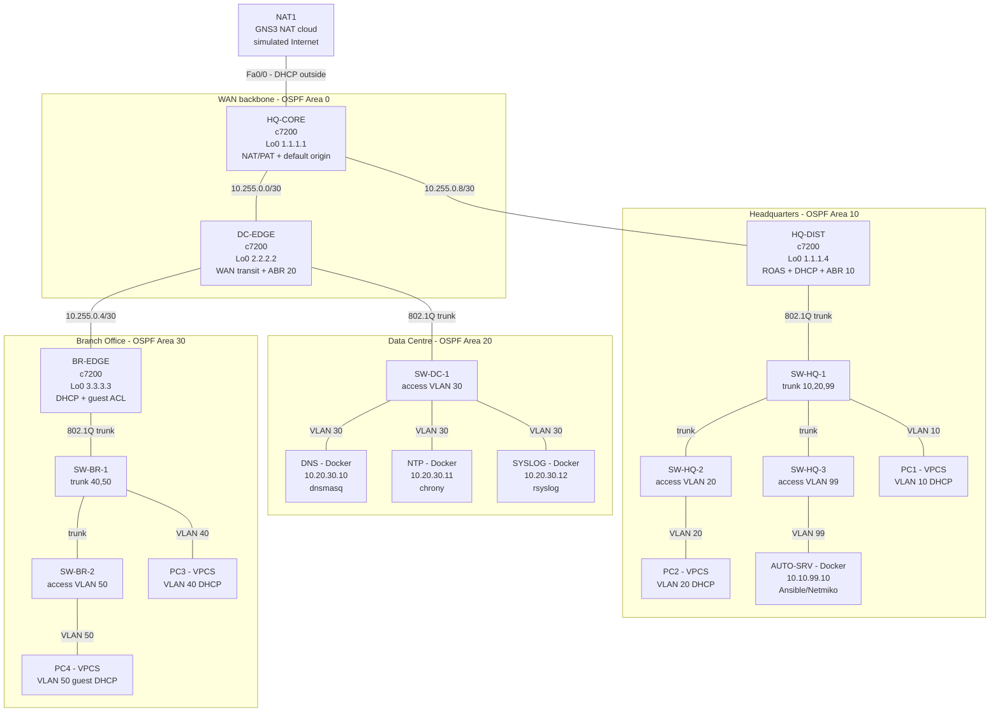

# MN521 Part A — Physical & Logical Topology

Three-site enterprise built in GNS3: **Headquarters (HQ)**, **Data Centre (DC)** and **Branch Office (BR)**.
Addressing is defined in [IP_ADDRESSING.md](IP_ADDRESSING.md) and is authoritative; this document defines
the node inventory, cabling and switch port roles that implement it.

## 1. Node inventory

| # | Node | GNS3 template | Role | Management address |
|---|------|---------------|------|--------------------|
| 1 | `HQ-CORE` | Cisco c7200 (Dynamips) | Internet edge, NAT/PAT, OSPF backbone | `Lo0 1.1.1.1/32` |
| 2 | `HQ-DIST` | Cisco c7200 (Dynamips) | HQ distribution, 802.1Q ROAS, DHCP, ABR area 10 | `Lo0 1.1.1.4/32` |
| 3 | `DC-EDGE` | Cisco c7200 (Dynamips) | Data Centre gateway, WAN transit, DHCP, ABR area 20 | `Lo0 2.2.2.2/32` |
| 4 | `BR-EDGE` | Cisco c7200 (Dynamips) | Branch gateway, DHCP, guest isolation, ABR area 30 | `Lo0 3.3.3.3/32` |
| 5 | `SW-HQ-1` | GNS3 Ethernet switch | HQ access/aggregation (VLAN 10 + trunks) | n/a (unmanaged) |
| 6 | `SW-HQ-2` | GNS3 Ethernet switch | HQ corporate access (VLAN 20) | n/a |
| 7 | `SW-HQ-3` | GNS3 Ethernet switch | HQ management access (VLAN 99) | n/a |
| 8 | `SW-DC-1` | GNS3 Ethernet switch | Data Centre server access (VLAN 30) | n/a |
| 9 | `SW-BR-1` | GNS3 Ethernet switch | Branch access/aggregation (VLAN 40 + trunk) | n/a |
| 10 | `SW-BR-2` | GNS3 Ethernet switch | Branch guest access (VLAN 50) | n/a |
| 11 | `AUTO-SRV` | Docker — Ubuntu 22.04 | Ansible / Netmiko automation host (Part B) | `10.10.99.10/24` |
| 12 | `DNS` | Docker — Ubuntu 22.04 | `dnsmasq` authoritative for `corp.local` | `10.20.30.10/24` |
| 13 | `NTP` | Docker — Ubuntu 22.04 | `chrony` stratum-10 time source | `10.20.30.11/24` |
| 14 | `SYSLOG` | Docker — Ubuntu 22.04 | `rsyslog` collector (UDP/TCP 514) | `10.20.30.12/24` |
| 15 | `PC1` | VPCS | HQ user (VLAN 10) | DHCP from `HQ-DIST` |
| 16 | `PC2` | VPCS | HQ corporate (VLAN 20) | DHCP from `HQ-DIST` |
| 17 | `PC3` | VPCS | Branch user (VLAN 40) | DHCP from `BR-EDGE` |
| 18 | `PC4` | VPCS | Branch guest (VLAN 50) | DHCP from `BR-EDGE` |
| 19 | `NAT1` | GNS3 NAT cloud | Simulated Internet / upstream DHCP server | `192.168.122.0/24` (GNS3 default) |

Totals: **4 routers, 6 switches, 4 Docker service nodes, 4 VPCS hosts, 1 NAT cloud**.

## 2. Diagram

## 3. Full link table

Router slots are populated as: **slot 0 = C7200-IO-FE** (`FastEthernet0/0`), **slot 1 = PA-FE-TX**
(`FastEthernet1/0`), **slot 2 = PA-FE-TX** (`FastEthernet2/0`). Only FastEthernet interfaces are used, so
every link below is 100 Mbit/s — this keeps OSPF cost arithmetic uniform and matches what Dynamips emulates
reliably.

### 3.1 Routed links (Layer 3)

| # | A end | A interface | A address | B end | B interface | B address | Subnet | OSPF area |
|---|-------|-------------|-----------|-------|-------------|-----------|--------|-----------|
| L1 | `NAT1` | `nat0` (port 0) | GNS3 DHCP pool | `HQ-CORE` | `Fa0/0` | learned via DHCP | `192.168.122.0/24` | none (NAT outside) |
| L2 | `HQ-CORE` | `Fa1/0` | `10.255.0.1/30` | `DC-EDGE` | `Fa0/0` | `10.255.0.2/30` | `10.255.0.0/30` | 0 |
| L3 | `HQ-CORE` | `Fa2/0` | `10.255.0.9/30` | `HQ-DIST` | `Fa0/0` | `10.255.0.10/30` | `10.255.0.8/30` | 0 |
| L4 | `DC-EDGE` | `Fa1/0` | `10.255.0.5/30` | `BR-EDGE` | `Fa0/0` | `10.255.0.6/30` | `10.255.0.4/30` | 0 |

### 3.2 Trunk links (802.1Q)

| # | A end | A interface | B end | B port | Allowed VLANs | Native VLAN | Router subinterfaces |
|---|-------|-------------|-------|--------|---------------|-------------|----------------------|
| L5 | `HQ-DIST` | `Fa1/0` | `SW-HQ-1` | port 0 (`dot1q`) | 10, 20, 99 | 1 (unused) | `Fa1/0.10`, `Fa1/0.20`, `Fa1/0.99` |
| L6 | `SW-HQ-1` | port 2 (`dot1q`) | `SW-HQ-2` | port 0 (`dot1q`) | 10, 20, 99 | 1 (unused) | — |
| L7 | `SW-HQ-1` | port 3 (`dot1q`) | `SW-HQ-3` | port 0 (`dot1q`) | 10, 20, 99 | 1 (unused) | — |
| L8 | `DC-EDGE` | `Fa2/0` | `SW-DC-1` | port 0 (`dot1q`) | 30 | 1 (unused) | `Fa2/0.30` |
| L9 | `BR-EDGE` | `Fa1/0` | `SW-BR-1` | port 0 (`dot1q`) | 40, 50 | 1 (unused) | `Fa1/0.40`, `Fa1/0.50` |
| L10 | `SW-BR-1` | port 2 (`dot1q`) | `SW-BR-2` | port 0 (`dot1q`) | 40, 50 | 1 (unused) | — |

All VLANs are **tagged**; nothing is carried on the native VLAN. This removes any native-VLAN mismatch
between the GNS3 Ethernet switch and the router subinterfaces, and it means VLAN 1 stays completely unused
(a common hardening requirement).

### 3.3 Access links (Layer 2 edge)

| # | Switch | Port | Mode | VLAN | End device | Device interface | Address |
|---|--------|------|------|------|------------|------------------|---------|
| L11 | `SW-HQ-1` | port 1 | access | 10 | `PC1` | `e0` | DHCP → `10.10.10.21+` |
| L12 | `SW-HQ-2` | port 1 | access | 20 | `PC2` | `e0` | DHCP → `10.10.20.21+` |
| L13 | `SW-HQ-3` | port 1 | access | 99 | `AUTO-SRV` | `eth0` | `10.10.99.10/24` (static) |
| L14 | `SW-DC-1` | port 1 | access | 30 | `DNS` | `eth0` | `10.20.30.10/24` (static) |
| L15 | `SW-DC-1` | port 2 | access | 30 | `NTP` | `eth0` | `10.20.30.11/24` (static) |
| L16 | `SW-DC-1` | port 3 | access | 30 | `SYSLOG` | `eth0` | `10.20.30.12/24` (static) |
| L17 | `SW-BR-1` | port 1 | access | 40 | `PC3` | `e0` | DHCP → `10.30.40.21+` |
| L18 | `SW-BR-2` | port 1 | access | 50 | `PC4` | `e0` | DHCP → `10.30.50.21+` |

### 3.4 Reserved / unused interfaces

| Device | Interface | State | Reason |
|--------|-----------|-------|--------|
| `HQ-DIST` | `Fa2/0` | `shutdown`, no address | Reserved growth port for a fourth HQ access switch. Kept administratively down so it cannot become an unauthenticated entry point. |
| all routers | `line aux 0` | `no exec` | Unused management line disabled. |

## 4. GNS3 Ethernet switch port matrix

Copy these into each switch's **Configuration → Ports** tab (`VLAN` / `Type`):

| Switch | port 0 | port 1 | port 2 | port 3 |
|--------|--------|--------|--------|--------|
| `SW-HQ-1` | 1 / dot1q (to `HQ-DIST Fa1/0`) | 10 / access (`PC1`) | 1 / dot1q (to `SW-HQ-2`) | 1 / dot1q (to `SW-HQ-3`) |
| `SW-HQ-2` | 1 / dot1q (to `SW-HQ-1`) | 20 / access (`PC2`) | — | — |
| `SW-HQ-3` | 1 / dot1q (to `SW-HQ-1`) | 99 / access (`AUTO-SRV`) | — | — |
| `SW-DC-1` | 1 / dot1q (to `DC-EDGE Fa2/0`) | 30 / access (`DNS`) | 30 / access (`NTP`) | 30 / access (`SYSLOG`) |
| `SW-BR-1` | 1 / dot1q (to `BR-EDGE Fa1/0`) | 40 / access (`PC3`) | 1 / dot1q (to `SW-BR-2`) | — |
| `SW-BR-2` | 1 / dot1q (to `SW-BR-1`) | 50 / access (`PC4`) | — | — |

## 5. Traffic-flow summary

| Flow | Path | Enforcement |
|------|------|-------------|
| HQ user → Internet | `PC1` → `HQ-DIST` → `HQ-CORE` → `NAT1` | PAT on `HQ-CORE Fa0/0` |
| Branch user → DC services | `PC3` → `BR-EDGE` → `DC-EDGE` → `SW-DC-1` | permitted (OSPF area 30 → 0 → 20) |
| Branch guest → Internet | `PC4` → `BR-EDGE` → `DC-EDGE` → `HQ-CORE` → `NAT1` | permitted by `ACL_GUEST_IN` final `permit` |
| Branch guest → DC servers / HQ mgmt | blocked at `BR-EDGE Fa1/0.50` in | `ACL_GUEST_IN`, re-checked by `ACL_WAN_BR_IN` on `DC-EDGE Fa1/0` |
| Branch guest → `DNS` (name resolution only) | `PC4` → `BR-EDGE` → `DC-EDGE` → `DNS:53` | explicit `permit udp/tcp … eq 53` above the deny rules |
| Automation SSH | `AUTO-SRV` (`10.10.99.10`) → any router VTY | `ACL_VTY` permits `10.10.99.0/24` and `10.20.30.0/24` only |
| Router → syslog / NTP / DNS | any router → `10.20.30.10-12` | sourced from `Loopback0` for syslog so log entries carry a stable identity |
