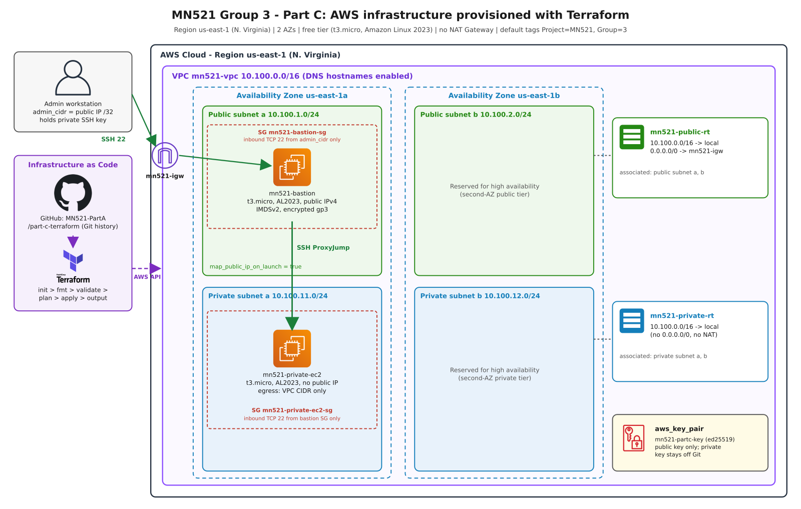

# MN521 Part C - AWS Infrastructure as Code with Terraform (Group 3)

This folder provisions the Part C cloud environment on AWS (free tier) with
Terraform. All infrastructure is declared in code, version-controlled in Git
and reproducible with a single `terraform apply`.

## Architecture



| Component | Value |
|-----------|-------|
| Region | `us-east-1` (N. Virginia, the region AWS Academy Learner Lab allows), 2 Availability Zones |
| VPC | `10.100.0.0/16` (DNS support and hostnames enabled) |
| Public subnets | `10.100.1.0/24` (AZ a), `10.100.2.0/24` (AZ b) |
| Private subnets | `10.100.11.0/24` (AZ a), `10.100.12.0/24` (AZ b) |
| Internet Gateway | attached to the VPC |
| Public route table | `10.100.0.0/16 -> local`, `0.0.0.0/0 -> IGW`; associated with both public subnets |
| Private route table | `10.100.0.0/16 -> local` only (no NAT Gateway, by design); associated with both private subnets |
| Bastion SG | inbound TCP 22 from `admin_cidr` only; outbound 22 to VPC, 80/443 for updates |
| Private EC2 SG | inbound TCP 22 **only from the bastion SG**; outbound to VPC CIDR only |
| Bastion host | Amazon Linux 2023, `t3.micro`, public subnet AZ a, public IPv4 |
| Private EC2 | Amazon Linux 2023, `t3.micro`, private subnet AZ a, no public IP |
| SSH key pair | `aws_key_pair` from a locally generated ed25519 public key |

Instances use IMDSv2 only and encrypted gp3 root volumes. The AMI is looked up
with an `aws_ami` data source (latest Amazon Linux 2023), so no AMI IDs are
hard-coded. All resources carry the default tags `Project=MN521`, `Group=3`,
`ManagedBy=Terraform`.

## Layout

```
part-c-terraform/
├── versions.tf               # Terraform + AWS provider version pins
├── providers.tf              # AWS provider, region, default tags
├── variables.tf              # Input variables with validation
├── terraform.tfvars.example  # Example values (copy to terraform.tfvars)
├── main.tf                   # Root module wiring the child modules
├── outputs.tf                # IDs, IPs and ready-to-use SSH commands
├── modules/
│   ├── vpc/                  # VPC, subnets, IGW, route tables, associations
│   ├── security/             # Bastion and private-instance security groups
│   └── compute/              # AMI lookup, key pair, bastion, private EC2
└── docs/architecture.png     # AWS architecture diagram
```

## Prerequisites

* Terraform >= 1.6 and the AWS CLI v2
* AWS credentials in the environment (`AWS_ACCESS_KEY_ID`, `AWS_SECRET_ACCESS_KEY`)
  or an AWS CLI profile. Credentials are never written into the code.
* An SSH key pair generated locally (the private key never leaves the workstation
  and is excluded by `.gitignore`):

```bash
ssh-keygen -t ed25519 -N "" -C "mn521-partc-group3" -f ~/.ssh/mn521_partc_ed25519
```

## Terraform workflow

```bash
cd part-c-terraform
cp terraform.tfvars.example terraform.tfvars
# set admin_cidr to your public IP /32
echo "admin_cidr = \"$(curl -s https://checkip.amazonaws.com)/32\""

terraform init                 # download the pinned AWS provider, init modules
terraform fmt -check -recursive  # canonical formatting
terraform validate             # syntax and type checking
terraform plan -out=tfplan     # preview the change set (saved plan)
terraform apply tfplan         # create exactly what was planned
terraform output               # show IDs, IPs, SSH commands
terraform destroy              # remove everything when finished
```

## Connecting through the bastion (ProxyJump)

```bash
# bastion
ssh -i ~/.ssh/mn521_partc_ed25519 ec2-user@$(terraform output -raw bastion_public_ip)

# private EC2 via the bastion (key loaded in ssh-agent)
ssh-add ~/.ssh/mn521_partc_ed25519
ssh -J ec2-user@$(terraform output -raw bastion_public_ip) \
    ec2-user@$(terraform output -raw private_instance_private_ip)
```

Or append `terraform output -raw ssh_config_snippet` to `~/.ssh/config` and run
`ssh mn521-private`.

The private instance has no route to the internet (no NAT Gateway), so it is
reachable only from inside the VPC through the bastion.

## Cost

Everything fits the AWS free tier: two `t3.micro` instances (750 instance-hours
per month shared), two small gp3 volumes (within 30 GB), and one public IPv4
address on the bastion. VPC, subnets, route tables, IGW, security groups and
key pairs are free. No NAT Gateway is created. Run `terraform destroy` when
the environment is no longer required.
