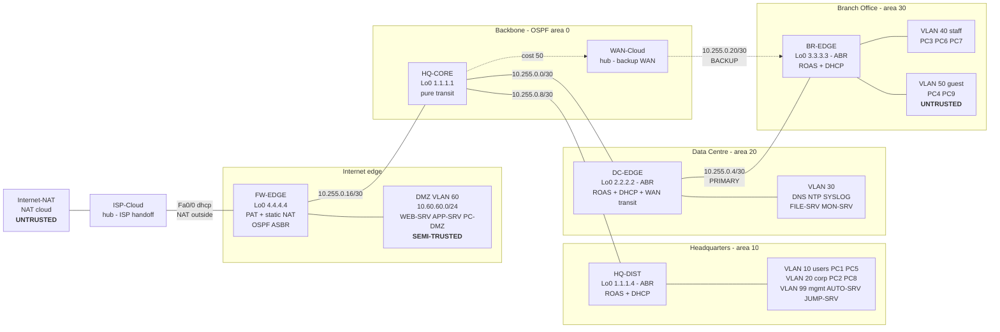
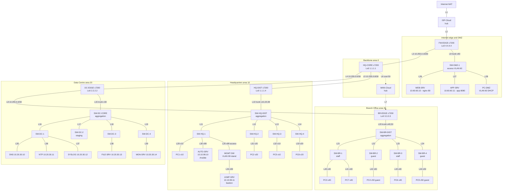
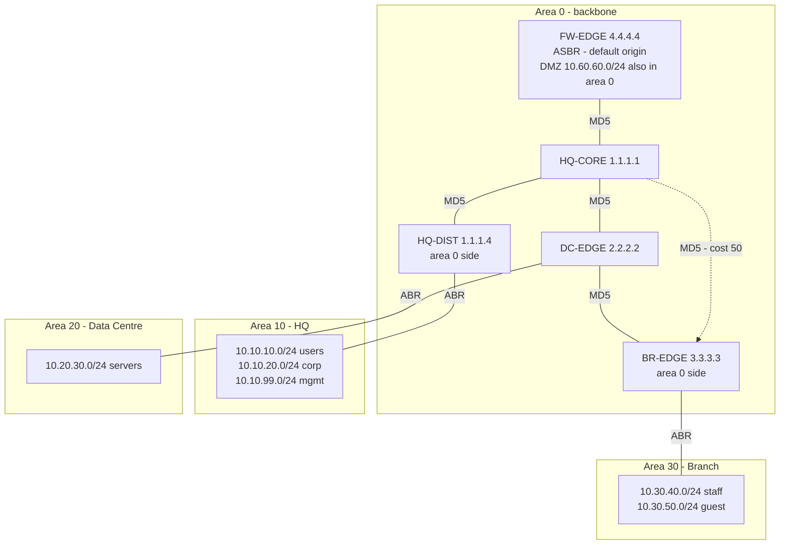

<!--
BUILD: see report/BUILD_DOCX.md for the pandoc command that produces a .docx in the
format the brief requires (MS Word, 1.5 spacing, 11 pt Calibri, 2.54 cm margins).

WORD BUDGET: the brief sets a 2000-word limit for the whole report (Parts A, B and C
plus Documentation). Section 1-8 below is the assessable narrative for Part A and is
budgeted at ~750 words, leaving room for Parts B and C. Tables, figures, code
listings, references and appendices are conventionally excluded from a word count,
which is why the detail in this report lives there rather than in prose. Do not pad
sections 1-8; the marks for depth come from the appendices and the referenced
documents, not from length.

SCREENSHOTS: every figure is a placeholder. Capture per verification/CHECKS.md §12
and save as report/figures/SS-nn-<slug>.png. Nothing in section 7 asserts a measured
result that has not been captured.
-->

# Executive Summary

A multinational enterprise migrating to automated hybrid-cloud operations requires a
network that is segmented, resilient and mechanically reproducible. This part
delivers that foundation: a four-zone enterprise network built in GNS3 comprising 44
nodes — five Cisco c7200 routers, seventeen switches, nine Linux servers, ten
endpoints, an ISP transit segment and a redundant WAN segment.

The design exceeds the specified minimum of four routers, six switches and one
automation server, and each addition carries policy or service rather than visual
weight: a dedicated edge firewall creates a DMZ where an inbound session can safely
terminate; a second WAN path via an Ethernet transit segment provides Layer 3
resilience; and a separated management island distinguishes automated from
interactive administration. All ten required services are implemented — VLANs,
inter-VLAN routing, OSPF, DHCP, SSH, ACLs, NAT, DNS, NTP and Syslog.

A structured technical review of the configuration package identified twenty defects,
including four of critical severity: a published DMZ service that could not receive a
packet, a guest access-control list that permitted the traffic it was written to
block, a redundant WAN path that silently bypassed a security enforcement point, and
three undetected Layer 2 loops on a switching platform with no spanning tree. All are
corrected, and the corrections are now enforced mechanically by a configuration
validator rather than by inspection.

---

# 1. Introduction

The enterprise spans three operational sites — Headquarters, a Data Centre and a
Branch Office — joined by a routed core and reached from the public Internet through a
single controlled perimeter. Part A establishes the addressed, routed and secured
substrate that Part B automates with Ansible and Part C extends into AWS.

Three principles govern the design. **Segmentation before connectivity**: each user
population, service tier and trust level occupies its own VLAN, and traffic between
them is permitted only where a documented requirement exists. **One identity per
device**: every router's `Loopback0` is simultaneously its OSPF router ID, syslog
source, NTP source, DNS query source and automation target, so routing, logging and
automation records all agree. **Configuration as the source of truth**: the five
router configurations are written to be template-generated and idempotently
re-applied, which is what makes Part B possible.

---

# 2. Enterprise Network Design

## 2.1 Topology

Four zones, five routers, a cost-engineered redundant WAN.

Figures 1–3 are rendered below from Mermaid source, so this report is self-contained.
For the `.docx` build they must be exported to PNG and inserted as images, because
pandoc does not render Mermaid — see [`BUILD_DOCX.md`](BUILD_DOCX.md) §5. Identical
source is maintained in [`docs/TOPOLOGY.md`](../docs/TOPOLOGY.md) §2.

### Figure 1 — Zone and trust overview

*Export to `figures/fig1-zones.png` for the `.docx`.*



### Figure 2 — Full physical topology, 44 nodes

*Export to `figures/fig2-physical.png` at `-w 3200`; consider a landscape page.*



### Figure 3 — Logical OSPF areas

*Export to `figures/fig3-ospf.png`.*



**Figure 4 — GNS3 project canvas.** *Screenshot placeholder: `figures/SS-02-topology.png`.*

| Zone | Trust | Gateway | OSPF area | Key contents |
|------|-------|---------|-----------|--------------|
| Internet | Untrusted | — | — | `Internet-NAT`, `ISP-Cloud` |
| DMZ | Semi-trusted | `FW-EDGE Fa2/0.60` | 0 | `WEB-SRV`, `APP-SRV`, `PC-DMZ` |
| Backbone | Trusted, no hosts | — | 0 | 5 routers, `WAN-Cloud` |
| Headquarters | Trusted | `HQ-DIST Fa2/0.10/.20/.99` | 10 | `AUTO-SRV`, `JUMP-SRV`, 4 endpoints |
| Data Centre | Trusted | `DC-EDGE Fa3/0.30` | 20 | `DNS`, `NTP`, `SYSLOG`, `FILE-SRV`, `MON-SRV` |
| Branch — staff | Trusted | `BR-EDGE Fa3/0.40` | 30 | `PC3`, `PC6`, `PC7` |
| Branch — guest | Untrusted | `BR-EDGE Fa3/0.50` | 30 | `PC4`, `PC9` |

Node and link counts are reconciled in [`docs/TOPOLOGY.md`](../docs/TOPOLOGY.md) §6:
44 nodes, and of 50 links, 44 forward traffic, 3 are cabled standby ports held
administratively down, and 3 must be removed because they close Layer 2 loops (§5.2).

## 2.2 IP addressing

Addressing follows `10.<zone>.<vlan>.<host>`, so an address identifies its own site
and VLAN without a lookup — which matters most when reading access-list denial logs.
Full plan in [`docs/IP_ADDRESSING.md`](../docs/IP_ADDRESSING.md); machine-readable
copies in [`tables/`](tables/).

**Table 1 — VLANs and subnets**

| VLAN | Name | Subnet | Gateway | Gateway interface | Area | Addressing |
|-----:|------|--------|---------|-------------------|-----:|------------|
| 10 | `HQ_USERS` | `10.10.10.0/24` | `10.10.10.1` | `HQ-DIST Fa2/0.10` | 10 | DHCP |
| 20 | `HQ_CORP` | `10.10.20.0/24` | `10.10.20.1` | `HQ-DIST Fa2/0.20` | 10 | DHCP |
| 99 | `HQ_MGMT` | `10.10.99.0/24` | `10.10.99.1` | `HQ-DIST Fa2/0.99` | 10 | static only |
| 30 | `DC_SERVERS` | `10.20.30.0/24` | `10.20.30.1` | `DC-EDGE Fa3/0.30` | 20 | static + DHCP |
| 40 | `BR_STAFF` | `10.30.40.0/24` | `10.30.40.1` | `BR-EDGE Fa3/0.40` | 30 | DHCP |
| 50 | `BR_GUEST` | `10.30.50.0/24` | `10.30.50.1` | `BR-EDGE Fa3/0.50` | 30 | DHCP, 4 h lease |
| 60 | `DMZ` | `10.60.60.0/24` | `10.60.60.1` | `FW-EDGE Fa2/0.60` | 0 | static + DHCP |
| 1 | *unused* | — | — | — | — | deliberately empty |

**Table 2 — WAN transit links**

| Link | Network | A end | B end | Transit | Cost |
|------|---------|-------|-------|---------|-----:|
| Internet | GNS3 NAT pool | `Internet-NAT` | `FW-EDGE Fa0/0` (DHCP) | `ISP-Cloud` | — |
| Edge ↔ Core | `10.255.0.16/30` | `FW-EDGE Fa1/0` `.17` | `HQ-CORE Fa0/0` `.18` | direct | 1 |
| Core ↔ DC | `10.255.0.0/30` | `HQ-CORE Fa1/0` `.1` | `DC-EDGE Fa0/0` `.2` | direct | 1 |
| Core ↔ HQ dist | `10.255.0.8/30` | `HQ-CORE Fa2/0` `.9` | `HQ-DIST Fa0/0` `.10` | direct | 1 |
| DC ↔ Branch (primary) | `10.255.0.4/30` | `DC-EDGE Fa1/0` `.5` | `BR-EDGE Fa0/0` `.6` | direct | 1 |
| Core ↔ Branch (backup) | `10.255.0.20/30` | `HQ-CORE Fa3/0` `.21` | `BR-EDGE Fa2/0` `.22` | `WAN-Cloud` | **50** |

**Table 3 — Router loopbacks and OSPF identity**

| Device | `Loopback0` | Router ID | Loopback area | OSPF role |
|--------|-------------|-----------|--------------:|-----------|
| `FW-EDGE` | `4.4.4.4/32` | `4.4.4.4` | 0 | ASBR — sole default originator |
| `HQ-CORE` | `1.1.1.1/32` | `1.1.1.1` | 0 | internal transit |
| `HQ-DIST` | `1.1.1.4/32` | `1.1.1.4` | 10 | ABR |
| `DC-EDGE` | `2.2.2.2/32` | `2.2.2.2` | 0 | ABR |
| `BR-EDGE` | `3.3.3.3/32` | `3.3.3.3` | 30 | ABR |

**Table 4 — Servers and endpoints.** Full per-node detail, including the specific
configuration file for each of the 44 nodes, is in
[`docs/NODE_INVENTORY.md`](../docs/NODE_INVENTORY.md).

| Host | Address | VLAN | Purpose |
|------|---------|-----:|---------|
| `AUTO-SRV` | `10.10.99.10` | 99 | Ansible / Netmiko automation server (Part B control node) |
| `JUMP-SRV` | `10.10.99.11` | 99 | SSH bastion for interactive administration |
| `DNS` | `10.20.30.10` | 30 | `dnsmasq`, authoritative for `corp.local` |
| `NTP` | `10.20.30.11` | 30 | `chrony`, `local stratum 10` |
| `SYSLOG` | `10.20.30.12` | 30 | `rsyslog`, UDP/TCP 514 collector |
| `FILE-SRV` | `10.20.30.13` | 30 | Internal file share — deliberately not published |
| `MON-SRV` | `10.20.30.14` | 30 | Monitoring and break-glass administrative origin |
| `WEB-SRV` | `10.60.60.10` | 60 | Public web service, published on TCP 80 |
| `APP-SRV` | `10.60.60.11` | 60 | Application tier, published on TCP 8080 |
| `PC1`, `PC5` | DHCP `.21+` | 10 | HQ users |
| `PC2`, `PC8` | DHCP `.21+` | 20 | HQ corporate |
| `PC3`, `PC6`, `PC7` | DHCP `.21+` | 40 | Branch staff |
| `PC4`, `PC9` | DHCP `.21+` | 50 | Branch guests — isolated |
| `PC-DMZ` | DHCP `.21+` | 60 | DMZ maintenance host |

## 2.3 Service mapping — the ten required configurations

Part A requires ten configurations. Each one below states where it is implemented, on
which devices, and which evidence slot proves it. This table is the spine of the
report: §4 gives a configuration excerpt per row, §6 gives a verification section per
row, and the sign-off matrix in
[`verification/CHECKS.md`](../verification/CHECKS.md) §11 closes each one out.

**Table 5 — The ten required services**

| # | Service | Implementation | Devices | Evidence |
|--:|---------|----------------|---------|----------|
| 1 | **VLANs** | 7 data VLANs, all carried tagged; VLAN 1 deliberately unused | 17 switches | `SS-04`, `SS-05` |
| 2 | **Inter-VLAN routing** | 802.1Q router-on-a-stick, 7 subinterfaces | `HQ-DIST`, `DC-EDGE`, `BR-EDGE`, `FW-EDGE` | `SS-06` |
| 3 | **OSPF** | Process 1, areas 0/10/20/30, 5 adjacencies, one ASBR, three ABRs | all 5 routers | `SS-07`, `SS-08`, `SS-10`–`SS-12` |
| 4 | **DHCP** | 6 pools with gateway, DNS server, domain name, option 42 and per-scope leases | `HQ-DIST`, `DC-EDGE`, `FW-EDGE` | `SS-13`–`SS-16` |
| 5 | **SSH** | SSHv2 only, local AAA, `transport input ssh`, source-restricted VTY | all 5 routers | `SS-27`, `SS-28` |
| 6 | **ACLs** | 6 named ACLs at 7 enforcement points, all with logged denials | all 5 routers | `SS-22`–`SS-26`, `SS-29` |
| 7 | **NAT** | PAT for four zones, plus two static port translations publishing DMZ services | `FW-EDGE` | `SS-30`–`SS-33` |
| 8 | **DNS** | `dnsmasq` authoritative for `corp.local` and forwarding; all 5 routers are clients | `DNS` + all 5 routers | `SS-34`, `SS-35` |
| 9 | **NTP** | `chrony` `local stratum 10`; routers synchronise at stratum 11 | `NTP` + all 5 routers | `SS-36` |
| 10 | **Syslog** | `rsyslog` on UDP/TCP 514; all 5 routers export, sourced from `Loopback0` | `SYSLOG` + all 5 routers | `SS-37`, `SS-38` |

The brief also requires a **Linux automation server**, provided by `AUTO-SRV`
(`10.10.99.10`) with Ansible and Netmiko installed and all five routers in its
inventory (`SS-39`). It is a Part A deliverable in its own right and the Part B control
node.

### Enhancements beyond the required ten

Three things in the configuration are **not** Part A requirements. They are recorded
here so they are not mistaken for scope, and they are not argued for at length anywhere
in this report:

| Enhancement | What it adds | Where |
|-------------|--------------|-------|
| OSPF area 0 MD5 authentication | Prevents an unauthorised device on a WAN segment injecting LSAs. Adopted because the backbone has a redundant path and the cost was one line per interface | `configs/*.cfg`, `router ospf 1` |
| Redundant WAN with cost engineering | Layer 3 resilience for the Branch, and it keeps the ACL enforcement point in the normal path | `HQ-CORE Fa3/0`, `BR-EDGE Fa2/0` |
| CBAC stateful inspection | Would replace the stateless return-traffic matching at the perimeter. **Supplied commented-out and not enabled** | `configs/FW-EDGE.cfg` |

Each is a single-line mention in the discussion (§7) and nothing more.

---

# 3. Design Justification

Condensed here; the full argument, with alternatives considered and rejected, is in
[`docs/DESIGN_JUSTIFICATION.md`](../docs/DESIGN_JUSTIFICATION.md).

**A dedicated edge router.** Collapsing PAT, perimeter filtering, default-route
origination and the area 0 backbone onto one device — the design's own earlier
revision — means a backbone change can modify the Internet edge, and leaves nowhere
for an inbound session to terminate safely. `FW-EDGE` separates them and creates the
DMZ.

**OSPF, multi-area.** Static routing offers no reconvergence, so the redundant WAN
would exist without functioning; RIP's 30-second updates are incompatible with
sub-minute failover; EIGRP is proprietary where the design targets vendor-neutral
operation [1]. Multi-area confines an access-layer flap to its own area, emitting one
type-3 summary into a backbone whose database holds only the WAN links.

**A backup path that is deliberately not equal-cost.** Every link is FastEthernet, so
the default cost is a uniform 1 and the direct Branch-to-HQ path is *one* hop against
*two* through the Data Centre. Left at defaults, OSPF prefers it and Branch traffic
abandons the Data Centre enforcement point. `ip ospf cost 50` inverts the preference.
Equal-cost multipath was rejected because splitting traffic across both links halves
the coverage of every per-interface counter and makes paths non-deterministic — poor
properties in a design whose security evidence *is* per-interface counters.

**Anti-spoofing that enumerates what the enterprise owns.** The intuitive perimeter
filter, `deny ip 10.0.0.0 0.255.255.255 any`, is wrong here: the outside interface is
DHCP-addressed, and a GNS3 host network inside `10.0.0.0/8` would have its own DHCP
offer dropped, costing all four zones their Internet access with a symptom pointing
at the NAT cloud. Enumerating the five owned ranges is both robust and strictly
stronger, since it also blocks spoofed WAN-transit sources [2], [11].

**Access-list ordering as a design element.** In the guest ACL, the DHCP permit —
which must source from `any`, because a DISCOVER originates from `0.0.0.0` [5] — and
the DNS permits sit *above* the deny rules. Below them, the guest network would be
dead rather than restricted. Every ACL closes with an explicit entry, so the implicit
deny never decides policy and every drop is counted.

**Platform choices follow one constraint**: 4 GB of GNS3 VM RAM on an Apple silicon
host. Five Dynamips c7200 routers consume the entire budget at roughly 150 MB each,
which is precisely why density was added through switches, containers and hubs — all
effectively free — rather than more routers. The accepted cost is a switching layer
with no STP, port security or LACP; those are discussed as design intent and
explicitly not claimed as verified.

---

# 4. Device Configurations

Complete, validated configurations are in [`configs/`](../configs/) and reproduced in
Appendix A. The excerpts below are organised to follow Table 5 — **one subsection per
required service** — and each is chosen because it carries a decision that is not
obvious from reading the command.

| § | Required service |
|---|------------------|
| 4.1 | VLANs and inter-VLAN routing (1, 2) |
| 4.2 | OSPF (3) |
| 4.3 | DHCP (4) |
| 4.4 | SSH (5) |
| 4.5 | ACLs (6) |
| 4.6 | NAT (7) |
| 4.7 | DNS, NTP and Syslog (8, 9, 10) |
| 4.8 | Mechanical validation of all of the above |

## 4.1 VLANs and inter-VLAN routing — `HQ-DIST`

```
interface FastEthernet2/0
 description TRUNK_802.1Q_TO_SW-HQ-DIST_Eth0_VLANS_10_20_99_TAGGED
 no ip address
!
interface FastEthernet2/0.10
 encapsulation dot1Q 10
 ip address 10.10.10.1 255.255.255.0
 ip access-group ACL_HQ_USERS_IN in
 no ip proxy-arp
 no ip redirects
```

One physical port carries three VLANs. The seven data VLANs are all carried **tagged**
with VLAN 1 left unused, which removes the native-VLAN mismatch class of fault: a
router subinterface accepts only tagged frames, so anything arriving untagged is
discarded rather than silently joining the wrong VLAN. `no ip proxy-arp` prevents a
host being tricked into using the router as a relay for off-subnet addresses; the ACL
is applied inbound so denied traffic is dropped at the first Layer 3 hop.

The same pattern provides the other three gateways — `DC-EDGE Fa3/0.30` (VLAN 30),
`BR-EDGE Fa3/0.40/.50` (VLANs 40, 50) and `FW-EDGE Fa2/0.60` (VLAN 60) — so all seven
VLANs are routed by four routers over four trunks.

## 4.2 OSPF — `HQ-CORE`

```
router ospf 1
 router-id 1.1.1.1
 passive-interface default
 no passive-interface FastEthernet0/0
 no passive-interface FastEthernet1/0
 no passive-interface FastEthernet2/0
 no passive-interface FastEthernet3/0
 network 1.1.1.1 0.0.0.0 area 0
 network 10.255.0.0 0.0.0.3 area 0
 network 10.255.0.8 0.0.0.3 area 0
 network 10.255.0.16 0.0.0.3 area 0
 network 10.255.0.20 0.0.0.3 area 0
```

Multi-area OSPF with four areas: 0 for the backbone, and 10, 20, 30 for the three
sites. `HQ-DIST`, `DC-EDGE` and `BR-EDGE` are ABRs; `FW-EDGE` is the single ASBR and the
only originator of the default route.

`passive-interface default` with explicit exceptions is the decision worth noting:
hellos are sent only on the four WAN links where a neighbour is expected, so no user,
server, guest or DMZ segment can form an adjacency. The VLAN prefixes are still
advertised — what is suppressed is neighbour formation, not reachability.

*(Enhancement, not a requirement: `area 0 authentication message-digest` with a
per-interface MD5 key is also configured on all five routers.)*

## 4.3 DHCP — `BR-EDGE`

```
ip dhcp excluded-address 10.30.40.1 10.30.40.20
ip dhcp excluded-address 10.30.50.1 10.30.50.20
!
ip dhcp pool VLAN40_BR_STAFF
 network 10.30.40.0 255.255.255.0
 default-router 10.30.40.1
 dns-server 10.20.30.10
 domain-name corp.local
 option 42 ip 10.20.30.11
 lease 2
!
ip dhcp pool VLAN50_BR_GUEST
 network 10.30.50.0 255.255.255.0
 default-router 10.30.50.1
 dns-server 10.20.30.10
 domain-name guest.corp.local
 lease 0 4
```

Six pools across three routers. Every pool excludes `.1`–`.20`, so a static server
address and a DHCP lease can never collide and every lease begins at `.21`.

The two pools above are deliberately different, and each difference is a control. The
guest scope carries a four-hour lease instead of two days, matching transient visitor
devices so the pool is not exhausted by devices that have left. It advertises
`guest.corp.local` instead of `corp.local`, which makes a guest lease self-evident from
the client side — the cheapest available proof that scope separation works, visible in
`show ip` without touching a router. And it omits option 42, because guests have no
reason to be handed the enterprise time source.

Two pools are notable for what they do **not** serve. There is no pool on VLAN 99: the
management VLAN is static-only by design, because it is the one subnet `ACL_VTY` trusts,
and a pool there would automatically address an unknown host into it. And
`VLAN30_DC_SERVERS` is expected to show zero leases, since all five Data Centre servers
are static — it exists for the staging ports on `SW-DC-2`.

## 4.4 SSH — all five routers

```
ip domain-name corp.local
ip ssh version 2
ip ssh time-out 60
ip ssh authentication-retries 2
username admin privilege 15 secret Cisco123!
!
line vty 0 4
 access-class ACL_VTY in
 exec-timeout 10 0
 login local
 transport input ssh
!
line vty 5 15
 access-class ACL_VTY in
 exec-timeout 10 0
 login local
 transport input ssh
```

`transport input ssh` disables Telnet outright rather than merely deprioritising it, so
credentials never cross the WAN in clear text. Both VTY ranges are guarded: IOS provides
sixteen lines, so protecting only `0 4` leaves a sixth concurrent session unfiltered —
a control that appears applied and is bypassable under load [8].

One step cannot be configured here. `crypto key generate rsa` is an exec-mode command,
so the RSA host key is generated once per router after boot; until it is,
`show ip ssh` reports `SSH Disabled` and every SSH attempt fails regardless of the
ACLs. Re-applying a startup configuration does not restore it, because key material is
not part of the configuration.

## 4.5 ACLs — `BR-EDGE` guest containment

```
ip access-list extended ACL_GUEST_IN
 permit udp any eq bootpc any eq bootps
 permit udp 10.30.50.0 0.0.0.255 host 10.20.30.10 eq domain
 permit tcp 10.30.50.0 0.0.0.255 host 10.20.30.10 eq domain
 permit icmp 10.30.50.0 0.0.0.255 host 10.30.50.1
 deny   ip 10.30.50.0 0.0.0.255 10.10.0.0 0.0.255.255 log
 deny   ip 10.30.50.0 0.0.0.255 10.20.0.0 0.0.255.255 log
 deny   ip 10.30.50.0 0.0.0.255 10.30.0.0 0.0.255.255 log
 deny   ip 10.30.50.0 0.0.0.255 10.60.60.0 0.0.0.255 log
 deny   ip 10.30.50.0 0.0.0.255 10.255.0.0 0.0.0.255 log
 permit ip 10.30.50.0 0.0.0.255 any
 deny   ip any any log
```

Six named ACLs are applied at seven enforcement points; this is the most instructive of
them. Every zone is denied *by name*, including the guest VLAN's own zone — which blocks
a guest reaching the Branch staff VLAN while leaving guest-to-guest traffic, which is
switched and never reaches the router, unaffected.

Entry order is the design, not an accident. The DHCP permit — which must source from
`any`, because a DISCOVER originates from `0.0.0.0` [5] — and the DNS permits sit
**above** the deny rules. Move them below and the guest network is dead rather than
restricted: no address, no name resolution. The list closes with an explicit
`deny ip any any log`, so the implicit deny never decides policy and every drop is
counted and logged.

**Table 6 — The six ACLs and their enforcement points**

| ACL | Device | Applied to | Purpose |
|-----|--------|-----------|---------|
| `ACL_OUTSIDE_IN` | `FW-EDGE` | `Fa0/0` in | Perimeter allow-list: anti-spoofing, two published services, closing deny |
| `ACL_DMZ_IN` | `FW-EDGE` | `Fa2/0.60` in | DMZ cannot initiate a session into any trusted zone |
| `ACL_WAN_BR_IN` | `DC-EDGE` | `Fa1/0` in | Guest containment on the primary WAN path |
| `ACL_WAN_BR_IN` | `HQ-CORE` | `Fa3/0` in | Same policy on the backup WAN path |
| `ACL_GUEST_IN` | `BR-EDGE` | `Fa3/0.50` in | First-hop guest containment |
| `ACL_HQ_USERS_IN` | `HQ-DIST` | `Fa2/0.10` in | HQ users cannot reach the management VLAN |
| `ACL_VTY` | all 5 | `line vty 0 4`, `5 15` | Administrative SSH from two named hosts plus a break-glass subnet |
| `ACL_NAT` | `FW-EDGE` | NAT source list | PAT scope — four zones, WAN transit excluded |

## 4.6 NAT: outbound PAT and inbound publishing — `FW-EDGE`

```
ip nat inside source list ACL_NAT interface FastEthernet0/0 overload
ip nat inside source static tcp 10.60.60.10 80   interface FastEthernet0/0 80
ip nat inside source static tcp 10.60.60.11 8080 interface FastEthernet0/0 8080
```

```
ip access-list extended ACL_OUTSIDE_IN
 deny   ip 10.10.0.0 0.0.255.255 any log
 ... (five owned ranges, loopback, link-local)
 permit tcp any any eq www
 permit tcp any any eq 8080
 permit udp any eq bootps any eq bootpc
 permit tcp any any established
 permit udp any any gt 1023
 ...
 deny   ip any any log
```

The published services are matched as `any any eq www`, **not** as
`any host 10.60.60.10 eq www`. For traffic arriving on a NAT *outside* interface, IOS
evaluates the inbound access list **before** outside-to-inside translation [4], so the
destination is still the outside global address; an ACL written against the DMZ
address can never match. The `bootps → bootpc` permit is equally load-bearing: with a
closing deny, the DHCP offer that gives the outside interface its address is itself
unsolicited inbound traffic.

## 4.7 DNS, NTP and Syslog — all five routers

The three infrastructure services are configured together because they share one design
decision, and because each depends on the one before it.

```
ip name-server 10.20.30.10
ip domain-lookup
ip domain-lookup source-interface Loopback0
!
ntp server 10.20.30.11 prefer
ntp source Loopback0
!
service timestamps log datetime msec localtime show-timezone
clock timezone AEST 10 0
logging trap informational
logging origin-id hostname
logging source-interface Loopback0
logging host 10.20.30.12
```

**All three are sourced from `Loopback0`.** That single choice gives every router one
stable identity across all three services: the query, the time request and the log entry
all arrive from the same address regardless of which interface the packet left by. It
matters most on `BR-EDGE`, which has two WAN paths and would otherwise log under two
different addresses depending on the failover state.

**They form a dependency chain, not three independent boxes.** Centralised logging is
only useful if entries from five devices can be ordered, which requires comparable
timestamps, which requires a common clock. So `clock timezone`,
`service timestamps log datetime msec localtime show-timezone` and the NTP client are
all prerequisites for the logging evidence [6], [7]. Getting the NTP client right and
omitting `service timestamps` — which is what the reviewed configuration did — produces
correct clocks and log entries carrying only an uptime counter.

Server side: `DNS` runs `dnsmasq` authoritative for `corp.local` with forward and
reverse records for all five routers, nine servers and seven gateways, forwarding
everything else upstream. `NTP` runs `chrony` as `local stratum 10`, which makes it
authoritative with no Internet reachability so the lab is demonstrable offline —
routers therefore synchronise at **stratum 11**, one level below, which is the correct
expected value rather than an error. `SYSLOG` runs `rsyslog` on UDP and TCP 514, writing
one file per sending device plus a single merged time-ordered file, because correlating
an ACL denial on `BR-EDGE` with the OSPF adjacency change on `DC-EDGE` that caused it is
far easier in one stream than across five.

## 4.8 Mechanical validation

`python3 scripts/validate_configs.py` asserts the properties that fail silently on
this platform: interface names that exist on a c7200 with slots 0–3, one block per
interface and line range, no access list referenced before definition, no exec-mode
command in a startup configuration, balanced banner delimiters, both VTY ranges
guarded, and the full security baseline. All five configurations pass. A configuration
naming `GigabitEthernet0/0` applies without error and does nothing, so this discipline
is a correctness requirement rather than style.

---

# 5. Technical Review and Corrections

A structured review against the live topology export — rather than against the
package's own documentation — found twenty defects. All are recorded with evidence and
resolution in [`docs/REVIEW_FINDINGS.md`](../docs/REVIEW_FINDINGS.md). The four
critical findings are summarised here because each is instructive.

## 5.1 The published DMZ service could not receive a packet

Two independent faults. The access list permitted inbound traffic to `10.60.60.10`,
which can never match because the ACL is evaluated before translation (§4.6); and no
static translation existed to map the outside address to the DMZ host. Inbound
publishing is the only NAT behaviour beyond outbound PAT, so the NAT requirement
rested on a path that could not carry traffic. The TCP 443 permit was *removed* rather
than fixed, because nothing in the DMZ terminates TLS and publishing it would
advertise a port with no listener.

## 5.2 Three Layer 2 loops with no spanning tree to break them

The topology contains three switch-to-switch cross-links, each closing a triangle with
its site aggregation switch. The GNS3 built-in switch implements no STP [3], so
broadcast frames circulate indefinitely and saturate the host — presenting as GNS3
being slow rather than as a cabling fault. The pre-existing mitigation (three
administratively shut router ports) addresses a *different* loop and leaves these
closed. Remediation is three link deletions; no switch loses connectivity, because
each retains its aggregation uplink.

## 5.3 The guest access list permitted what it was written to block

The original list denied two /24s and then permitted everything else, so guests could
reach both HQ user VLANs, the DMZ, every WAN transit address, and — most seriously —
the Branch staff VLAN on the adjacent switch. The list was very likely correct when
written; every subnet added since had silently widened it. This is the structural
weakness of deny-list filtering at a trust boundary, and the reason the corrected
lists enumerate zones by name and adding a zone is now a documented change-control
obligation.

## 5.4 The redundant WAN bypassed a security enforcement point

Guest containment was designed with two enforcement points, the second on
`DC-EDGE Fa1/0`. That control depends on the topological assumption that all Branch
traffic passes through it — which the backup WAN falsified, and which cost 1 would
have made the *normal* path rather than the failure path. Fixed by applying the ACL on
both possible WAN egress interfaces and by cost-engineering the backup, so policy
follows the packet rather than the path.

---

# 6. Testing and Verification

> **Verification is pending execution.** [`verification/CHECKS.md`](../verification/CHECKS.md)
> contains the full ordered plan — 12 sections, 60 checks, each with the command, the
> device, and a pass criterion written *before* the test. Results and screenshots are
> to be captured and inserted here. No measured result is asserted in this report
> ahead of capture.

The plan is ordered by dependency: an OSPF fault invalidates every reachability result
after it, and a DHCP fault invalidates every host test.

**Table 7 — Verification coverage of the ten required services**

| Service | Plan § | Proves | Evidence |
|---------|--------|--------|----------|
| **VLANs** (1) | 2.1–2.3, 2.5 | Each VLAN carries tagged traffic; VLAN 1 unused | `SS-04`, `SS-05` |
| **Inter-VLAN routing** (2) | 2.4, 5.1 | Traffic routed between VLANs and across sites | `SS-06`, `SS-17` |
| **OSPF** (3) | 3.1–3.2, 3.5–3.8 | 5 adjacencies FULL; correct ABR/ASBR roles; one default route; intended path preferred | `SS-07`, `SS-08`, `SS-10`–`SS-12` |
| **DHCP** (4) | 4.1–4.8 | Six pools; correct options; distinct guest and DMZ scopes | `SS-13`–`SS-16` |
| **SSH** (5) | 6.6–6.9 | Permitted from the two named hosts, refused **and logged** elsewhere; Telnet refused | `SS-27`, `SS-28` |
| **ACLs** (6) | 6.1–6.5, 6.10 | Guest, DMZ and management isolation enforced, with deny counters | `SS-22`–`SS-26`, `SS-29` |
| **NAT** (7) | 7.1–7.6 | Outbound PAT sharing one address; both published services reachable inbound | `SS-30`–`SS-33` |
| **DNS** (8) | 8.1–8.3 | Names resolve from a router and a host; forward and reverse | `SS-34`, `SS-35` |
| **NTP** (9) | 8.4–8.5 | All five routers synchronised at stratum 11, correct timezone | `SS-36` |
| **Syslog** (10) | 8.6–8.7 | Five per-device senders, timestamped, containing the ACL denials from §6 | `SS-37`, `SS-38` |
| Linux automation server | 8.8 | Ansible and Netmiko present, inventory reaches all five routers | `SS-39` |

Three further sections support rather than duplicate these: §0 pre-flight (validator
passes, correct configuration revision live, loop links removed), §1 interfaces
(addressing matches the design), and §9 resilience (WAN failover and failback — an
enhancement, not a required service).

Three design choices produce the most valuable evidence:

- **Selective isolation.** From a guest host, name resolution against the DNS server
  *succeeds* while ICMP to the same host *fails*. That pair together proves the guest
  network is restricted rather than merely broken — a single failing ping proves
  neither.
- **A positive and a negative control on the same fabric.** `PC3` (staff) and `PC4`
  (guest) sit on adjacent access switches at the same site with opposite policy
  outcomes, so the difference is attributable to policy rather than to topology.
- **Controls verified by presence where hits cannot be manufactured.** The perimeter
  anti-spoofing list will show zero matches in a lab with no hostile traffic. It is
  therefore verified by presence and placement, which is the correct expectation to
  state rather than fabricating counters.

Evidence placeholders `SS-01`–`SS-41`, each with its report caption, are indexed in
`CHECKS.md` §12 and land in [`figures/`](figures/).

---

# 7. Discussion

The most useful outcome of this part was not the build but the review. Four of the
twenty defects were invisible from reading the configuration in isolation and only
appeared when the configuration was compared against the topology it runs on. The
guest access list was internally coherent and would pass inspection; it was wrong
because the network had grown around it. The redundant WAN link was correct in
isolation; it invalidated a security control two devices away. This is the argument
for treating configuration as version-controlled artefact rather than device state,
which is exactly the premise of Part B.

Two structural lessons carry forward. First, **deny-lists at a trust boundary degrade
silently as a network grows**, while allow-lists fail loudly. The perimeter filter is
now an allow-list closing in an explicit deny; internal filters remain deny-lists
where the cost of a missed entry is lower, and each carries an explicit change-control
note. Second, **security controls that depend on topology are fragile**. The guest
containment control was written assuming a single WAN egress; the durable form of the
control applies at every interface a packet can arrive on, and the cost engineering is
what keeps the intended path intended.

The honest limitations are platform, not design. The switching layer offers no spanning
tree, port security or link aggregation, so Layer 2 redundancy is impossible and the
Layer 2 topology must be a loop-free tree by construction; redundancy therefore lives at
Layer 3, which is where this design would place it in production regardless.
Router-on-a-stick makes each site's inter-VLAN traffic share one 100 Mbit/s trunk that
the router CPU forwards packet by packet — the production remedy is a Layer 3 switch, and
the addressing and OSPF configuration transfer to it unchanged.

Three enhancements sit outside the required ten and are noted rather than argued: OSPF
area 0 MD5 authentication, the cost-engineered redundant WAN, and CBAC stateful
inspection at the perimeter — the last supplied commented-out, since the filter as
deployed matches return traffic structurally rather than against a session table, and
session tracking is expensive on emulated hardware shared with four other router
instances [10].

Finally, the configurations were written for what comes next. Named access lists with
remarks, a description on every interface naming both ends of its link, access lists
defined before the objects referencing them, and exactly one block per interface and
per line range are not stylistic preferences: IOS merges duplicate interface blocks,
so a configuration with two blocks for one interface works by accident but cannot be
rendered from a Jinja2 template or idempotently re-applied. The validator enforces
these properties so Part B inherits a package that is safe to generate.

---

# 8. Conclusion

Part A delivers a 44-node, four-zone enterprise network implementing **all ten required
configurations** — VLANs, inter-VLAN routing, OSPF, DHCP, SSH, ACLs, NAT, DNS, NTP and
Syslog — plus the required Linux automation server, exceeding the specified minimum in
routers, switches and servers while justifying each addition by the policy or service it
carries. Seven VLANs are routed over four 802.1Q trunks; OSPF runs multi-area across
five routers with a single ASBR; six DHCP pools serve ten endpoints with full options;
SSH is the only remote access path and is source-restricted on both VTY ranges; six ACLs
are enforced at seven points with logged denials; and the perimeter both translates
outbound traffic for four zones and publishes two DMZ services inbound.

Twenty configuration defects were identified and corrected, four of them critical, and
the properties that prevent their recurrence are now asserted by an automated
validator rather than trusted to review. Two remediation actions remain in the lab
environment: re-applying all five router configurations in a single pass, and deleting
three cross-links that close Layer 2 loops. Verification is planned in full and
pending execution, with results and screenshots to be inserted into §6.

The resulting configuration package — five router configurations, a switch port
matrix, nine server setup scripts and ten endpoint definitions, all cross-checked
against a single authoritative addressing plan — is the source of truth that Part B
automates with Ansible and Part C extends into AWS.

---

# References

[1] J. Moy, "OSPF Version 2," IETF RFC 2328, Apr. 1998. [Online]. Available: https://www.rfc-editor.org/rfc/rfc2328

[2] P. Ferguson and D. Senie, "Network Ingress Filtering: Defeating Denial of Service Attacks which employ IP Source Address Spoofing," IETF RFC 2827 (BCP 38), May 2000. [Online]. Available: https://www.rfc-editor.org/rfc/rfc2827

[3] IEEE, *IEEE Standard for Local and Metropolitan Area Networks — Bridges and Bridged Networks*, IEEE Std 802.1Q-2022, 2022.

[4] P. Srisuresh and K. Egevang, "Traditional IP Network Address Translator (Traditional NAT)," IETF RFC 3022, Jan. 2001. [Online]. Available: https://www.rfc-editor.org/rfc/rfc3022

[5] R. Droms, "Dynamic Host Configuration Protocol," IETF RFC 2131, Mar. 1997. [Online]. Available: https://www.rfc-editor.org/rfc/rfc2131

[6] R. Gerhards, "The Syslog Protocol," IETF RFC 5424, Mar. 2009. [Online]. Available: https://www.rfc-editor.org/rfc/rfc5424

[7] D. Mills, J. Martin, J. Burbank, and W. Kasch, "Network Time Protocol Version 4: Protocol and Algorithms Specification," IETF RFC 5905, Jun. 2010. [Online]. Available: https://www.rfc-editor.org/rfc/rfc5905

[8] T. Ylonen and C. Lonvick, "The Secure Shell (SSH) Protocol Architecture," IETF RFC 4251, Jan. 2006. [Online]. Available: https://www.rfc-editor.org/rfc/rfc4251

[9] Cisco Systems, *Campus LAN and Wireless LAN Design Guide*, Cisco Validated Design, Cisco Systems, Inc., San Jose, CA, USA, 2024.

[10] K. Scarfone and P. Hoffman, "Guidelines on Firewalls and Firewall Policy," National Institute of Standards and Technology, Gaithersburg, MD, USA, NIST SP 800-41 Rev. 1, Sep. 2009.

[11] Y. Rekhter, B. Moskowitz, D. Karrenberg, G. J. de Groot, and E. Lear, "Address Allocation for Private Internets," IETF RFC 1918 (BCP 5), Feb. 1996. [Online]. Available: https://www.rfc-editor.org/rfc/rfc1918

[12] GNS3 Technologies Inc., "GNS3 Documentation." [Online]. Available: https://docs.gns3.com

> **Note on citation style.** Verify each entry against the accessed source and add
> the access date for online items in the format your unit requires, e.g.
> "[Accessed: 12-Sep-2026]". Entry [9] should be updated to the exact Cisco Validated
> Design document and revision actually consulted.

---

# Generative AI Declaration

Generative AI tools were used in the preparation of this part, and are cited here in
accordance with the unit's submission guidelines and MIT's *Generative Artificial
Intelligence in Learning, Teaching and Research* policy.

| Item | Detail |
|------|--------|
| Tool | Anthropic Claude (large language model), accessed via the Cursor development environment |
| Date of use | September 2026 |
| **Purpose** | Reviewing the IOS configurations, switch port matrix and topology export for technical defects; drafting and structuring the documentation set; and authoring the configuration validation script |
| **Extent** | Applied to configuration review, correction and documentation drafting. The network design, the GNS3 build and all verification evidence are the authors' own work |
| **Not used for** | Generating verification results. No ping count, routing metric, translation table or log entry in this report was produced by an AI tool; §6 is explicitly marked pending execution against the live lab |
| Verification | All AI-suggested configuration changes were checked against vendor documentation and the standards cited in the reference list, and are asserted mechanically by `scripts/validate_configs.py`. All findings in `docs/REVIEW_FINDINGS.md` cite the specific configuration line or topology link they derive from |

Suggested reference-list entry:

[13] Anthropic, "Claude (Opus)," large language model, 2026. Used for configuration review, documentation drafting and validation scripting. [Online]. Available: https://www.anthropic.com/claude

---

# Appendices

| Appendix | Contents | Source |
|----------|----------|--------|
| A | Full router configurations, all five devices | [`configs/*.cfg`](../configs/) |
| B | Switch port and VLAN matrix, 17 switches | [`configs/switches/`](../configs/switches/) |
| C | Server setup scripts and netplan files, 9 servers | [`configs/linux/`](../configs/linux/), [`configs/netplan/`](../configs/netplan/) |
| D | Endpoint definitions, 10 hosts | [`configs/vpcs/`](../configs/vpcs/) |
| E | Complete node inventory — purpose, addressing and config artefact for all 44 nodes | [`docs/NODE_INVENTORY.md`](../docs/NODE_INVENTORY.md) |
| F | Full link map, 50 links | [`docs/TOPOLOGY.md`](../docs/TOPOLOGY.md) §3 |
| G | Verification plan and evidence | [`verification/CHECKS.md`](../verification/CHECKS.md) |
| H | Technical review findings register, 20 findings | [`docs/REVIEW_FINDINGS.md`](../docs/REVIEW_FINDINGS.md) |
| I | Full design justification | [`docs/DESIGN_JUSTIFICATION.md`](../docs/DESIGN_JUSTIFICATION.md) |
| J | Addressing tables in CSV | [`report/tables/`](tables/) |

**Assembling the group report.** Sections 1–8 above are the Part A narrative,
budgeted at roughly 750 words so that Parts B and C fit the 2000-word limit. Place
this between the group Introduction and the Part B section; merge the Executive
Summary, Discussion, Conclusion and reference list with the equivalent sections from
Parts B and C rather than repeating them. Build instructions for a brief-compliant
`.docx` are in [`BUILD_DOCX.md`](BUILD_DOCX.md).
